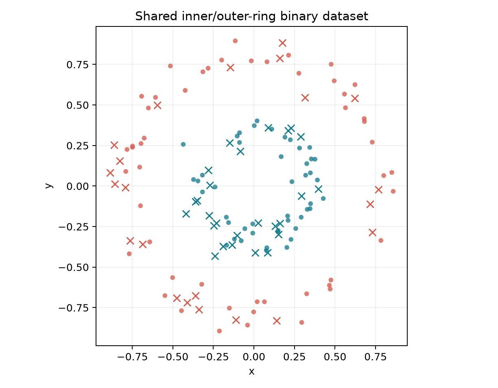
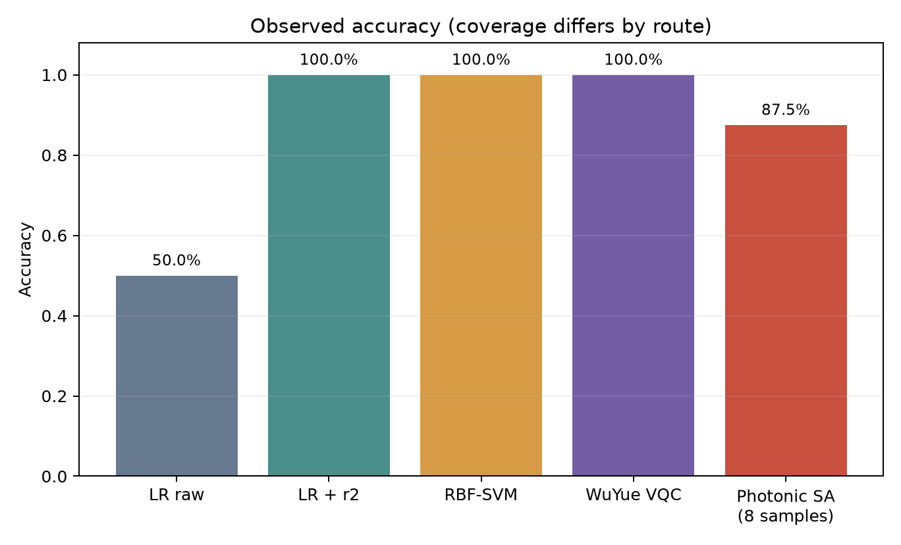
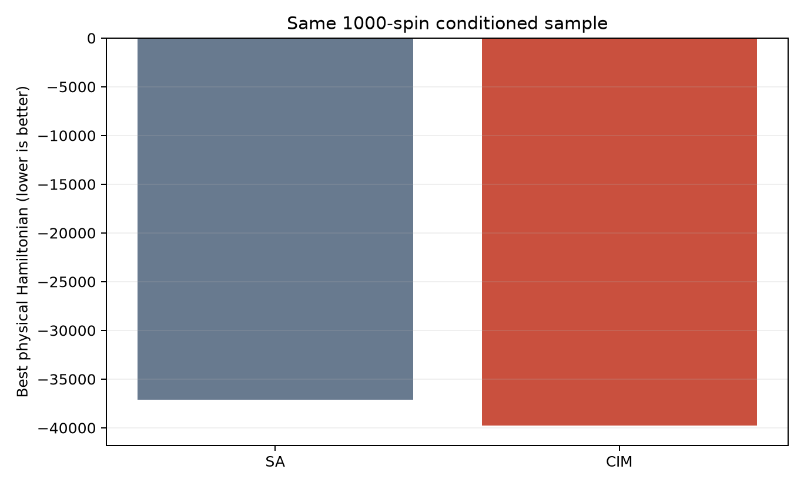

# QSNN 跨技术路线验证分析报告

## 1. 报告目的

本报告比较三条可复现路线：Kaiwu SDK/Qboson 相干光 Ising 求解、WuYue SDK 通用门模型 VQC、经典机器学习基线。目标不是宣称量子优势，而是验证同一项目能否分别完成组合优化建模、通用量子线路构建、云模拟、真机任务链路和经典对照。

## 2. 路线定义

| 路线 | 实际模型 | SDK | 计算资源 | 当前状态 |
|---|---|---|---|---|
| 相干光 | 1000 自旋 QSNN-inspired Ising 吸引子分类器 | Kaiwu 1.3.1 | Qboson-1000 | 真机计算成功 |
| 通用量子 | 9 qubit 容器、3 个有效比特的可训练 VQC | WuYue 1.0 | 全振幅云模拟器 | 云模拟成功 |
| 超导真机 | 与云模拟相同的 WuYue VQC 线路 | WuYue 1.0 | Baihua | 2026-08-14 提交时平台维护中 |
| 经典 | 逻辑回归、RBF-SVM、SA | scikit-learn/Kaiwu | CPU | 完成 |

## 3. 共同任务与公平性边界

VQC 和经典基线使用相同的 144 个二维圆环样本，训练 96、测试 48，随机种子为 23。相干光 1000 自旋模型使用同一生成规律和随机种子，但总样本数为 400，训练 320、测试 80；SA 只抽查 8 个测试样本，CIM 真机只执行 1 个条件样本。因此相干光的 87.5% 与 VQC 的 100% 不具有严格同预算可比性。

任务标签主要由半径决定。加入 $r^2$ 后，经典线性模型即可完成分类，所以本任务用于验证端到端链路，而不是展示量子计算优越性。

## 4. 相干光路线

相干光模型把输入钳制、三层固定随机储备池、监督岭回归读出、双类别吸引子编译为 $1000\times1000$ Ising 矩阵。矩阵包含 10,644 条独立非零耦合，有效精度为有符号 8 位。

物理能量写为

$$
H(s)=H_{\mathrm{in}}+H_{\mathrm{prop}}+H_{\mathrm{sem}}+H_{\mathrm{sink}}+H_{\mathrm{mutex}}+H_{\mathrm{route}}.
$$

它属于 QSNN-inspired 能量模型，不是 Lindblad 主方程的直接实现。CIM 的开放驱动、损耗和增益饱和促使网络进入低能吸引盆。

### 4.1 实测结果

| 指标 | 结果 |
|---|---:|
| SA 抽查样本 | 8 |
| SA 准确率 | 87.5% |
| SA 平均输入保持率 | 93.226% |
| CIM 任务 ID | `2608130MSS0TJIC01AZ4XHUMYTD0QZZL` |
| CIM 候选解 | 10 |
| CIM 预测/标签 | 0/0 |
| CIM 最佳能量 | -39794 |
| 同一样本 SA 最佳能量 | -37098 |

CIM 在该单一样本上找到比本次 SA 更低的能量，但这不能推出整体加速或量子优势。

## 5. WuYue 通用量子路线

VQC 完全使用 WuYue SDK `QuantumCircuit` 构建，门集为 `RY`、`RZ`、`CX` 和 `MEASURE`。9 qubit 是 Baihua 提交容器，实际使用 `q[2]`、`q[3]`、`q[4]`，双比特门只经过已验证边 `2-3`、`3-4`。

输入特征为 $x,y,r^2,xy$。线路可写为

$$
|000\rangle\xrightarrow{U_{\mathrm{enc}}(x,y)}
\xrightarrow{U_{\mathrm{var}}(\theta)}|\psi(x;\theta)\rangle,
$$

$$
p_1(x;\theta)=\langle\psi|\frac{I-Z_4}{2}|\psi\rangle.
$$

8 个参数通过 Nelder-Mead 最小化二元交叉熵。快速状态向量实现只用于缩短训练时间，训练后逐样本与 WuYue 全振幅 `Backend` 对照，最大绝对误差为 $3.33\times10^{-16}$。

### 5.1 模拟结果

| 指标 | 结果 |
|---|---:|
| 参数量 | 8 |
| 优化迭代/函数评估 | 141/248 |
| 训练时间 | 4.523 s |
| 初始/最终损失 | 0.09616/0.04899 |
| 训练准确率 | 100% |
| 测试准确率 | 100% |
| 云模拟任务 ID | `2608140MSS8C2UB01APUH2W4T1C3B1SW` |
| 云模拟 shots | 1024 |
| 代表样本标签/预测 | 1/1 |
| 云模拟 $p_1$ | 0.97265625 |

### 5.2 Baihua 状态

2026-08-14 在本地测试、精确模拟和云模拟全部通过后，程序尝试向 `WuYue-QPU-Baihua` 提交同一线路。服务端返回“维护中”，任务未被创建。因此本文只声明 Baihua 提交入口和门禁已完成，不声明本轮真机执行成功。此前固定 9 比特 QSNN 相干线路任务 `2608130MSRVFEPQ01MP3Z19SO13LMCQW` 曾被平台接受，但仍处于状态码 1，不能替代本次 VQC 真机结果。

## 6. 经典算法结果

| 方法 | 特征 | 测试准确率 | 训练时长 |
|---|---|---:|---:|
| 逻辑回归 | $x,y$ | 50% | 约 0.015 s |
| 逻辑回归 | $x,y,r^2,xy$ | 100% | 约 0.002 s |
| RBF-SVM | $x,y$ | 100% | 约 0.002 s |

计时为当前机器单次墙钟测量，不是严格性能基准。结果清楚表明：显式径向特征或非线性核足以解决任务，经典方法明显更轻量。

## 7. 跨路线结论

### 7.1 哪条路线完成度更高

相干光路线是真机完成度最高的路线：它已在 Qboson-1000 上返回 10 个候选解。通用量子路线在算法完整性上更清楚：具备编码、参数化线路、纠缠、测量、损失和优化闭环，并已通过 WuYue 本地与云全振幅模拟，但 Baihua 受平台维护阻塞。

### 7.2 哪条路线更符合原始 QSNN

两者都不等同于可训练 Lindblad QSNN。相干光路线具有真实开放耗散和吸引子行为，但可编程对象是 Ising 耦合；通用门路线具有可控幺正门和测量，但没有实现定向 Lindblad 耗散。在当前硬件条件下，应分别称为“QSNN-inspired Ising surrogate”和“VQC/QSNN coherent baseline”。

### 7.3 是否存在量子优势

不存在可支持量子优势结论的证据。经典 RBF-SVM 和带 $r^2$ 的逻辑回归均达到 100%，且训练成本更低；CIM 只在一个样本上取得比一次 SA 更低的能量。项目亮点应定位为跨技术栈可复现实现、1000 自旋真机建模和同一任务上的门模型验证，而非性能超越。

## 8. 后续补测协议

1. Baihua 恢复后重新执行 `--mode baihua --shots 1024 --timeout 0`。
2. 获得任务 ID 后用 `--mode poll` 查询直至成功或失败。
3. 至少选择内环、外环、边界各 3 个样本，报告混淆矩阵与置信区间。
4. 相干光路线扩展至完整 80 样本 SA，并对分层代表样本执行重复 CIM。
5. 删除 $r^2$ 特征并增加噪声、分布外半径和随机标签消融。

## 9. 可复现证据

- 指标：`docs/competition/evidence/cross_route_metrics.json`
- 经典基线：`docs/competition/evidence/classical_baselines.csv`
- VQC 云模拟：`hardware/wuyue_vqc/outputs/vqc_cloud-simulator_report.json`
- 相干光实测：`hardware/kaiwu_qsnn_photonic/outputs/large_scale/large_qsnn_report.json`
- 所有报告均不含 AK、SK 或其他密钥。
