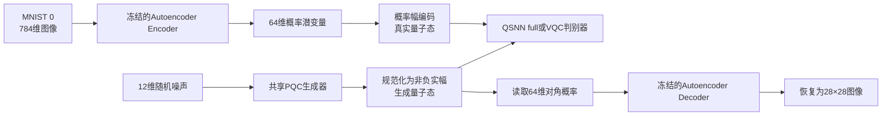
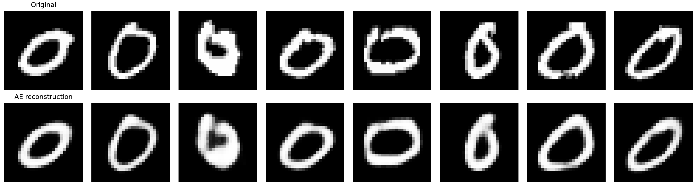
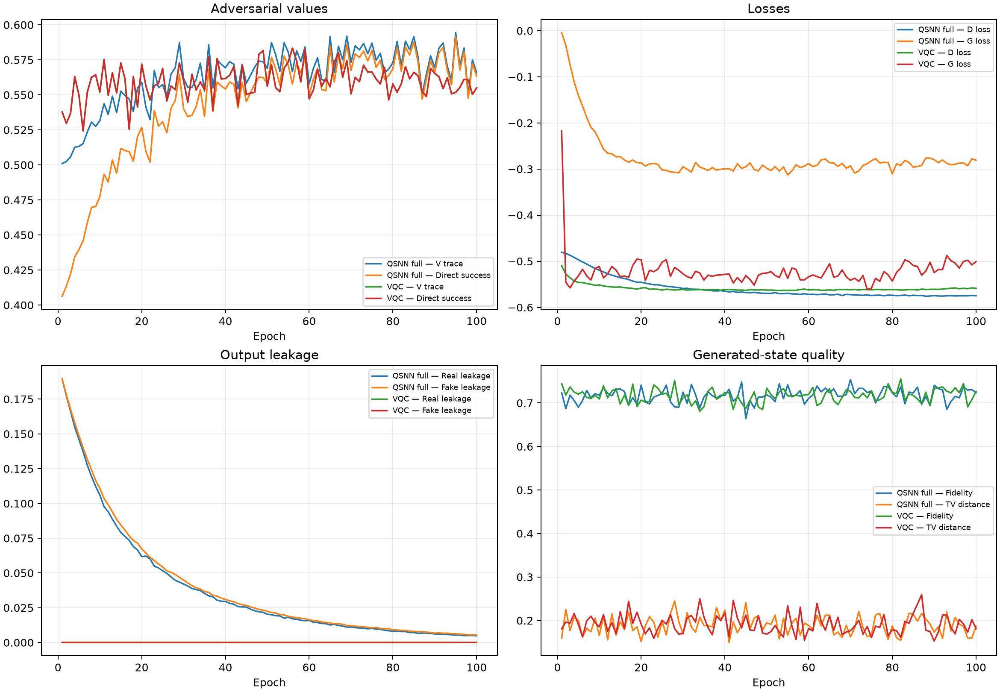
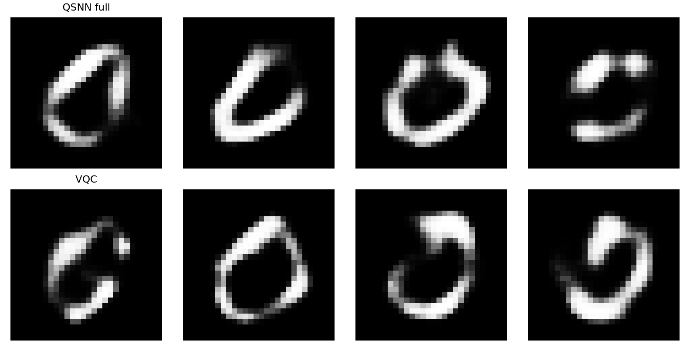
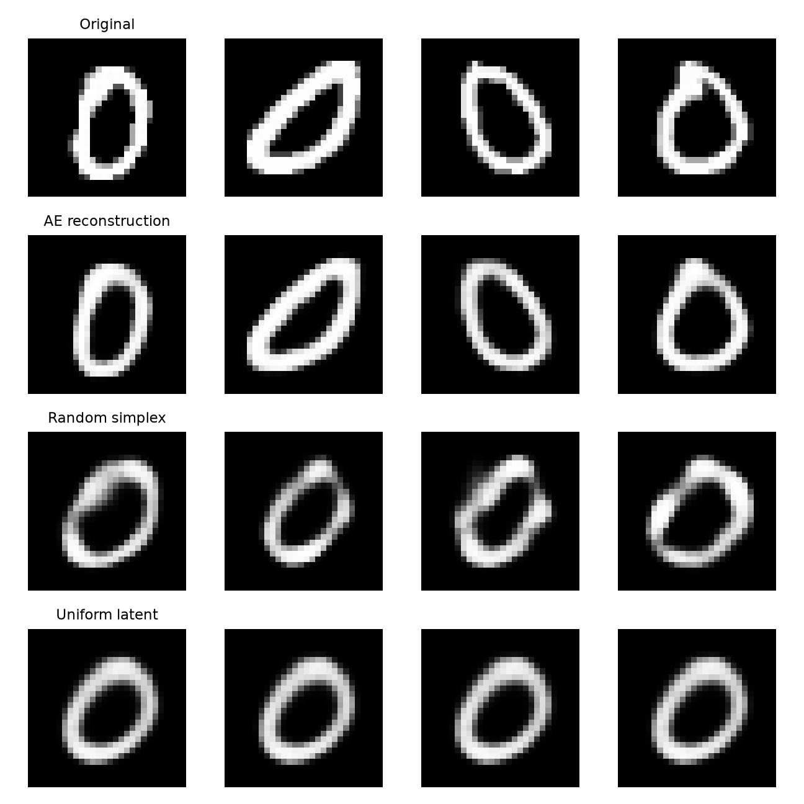

# Autoencoder-64 条件下 QSNN full 与 VQC 图像生成对照实验总结

## 1. 实验概况

- 实验日期：2026-07-14
- 实验状态：已完成
- 数据集：MNIST 数字 `0`
- 实验目标：在同一个 Autoencoder、同一个量子生成器和相同训练预算下，仅替换判别器，比较 `QSNN full` 与 `VQC` 对生成质量的影响
- 正式输出目录：[`outputs/qgan/ae64_comparison`](../../outputs/qgan/ae64_comparison/)
- Autoencoder 输出目录：[`outputs/autoencoder/mnist0_ae64_balanced`](../../outputs/autoencoder/mnist0_ae64_balanced/)
- 运行环境：`qsnn` Conda 环境、PyTorch `2.12.1+cu132`、NVIDIA GeForce RTX 5060

本实验解决了此前直接把 `28×28=784` 像素压缩成 `8×8=64` 后无法恢复到原图的问题。新的完整数据流为：



因此，本次实验已经实现了用户原先设想的完整路径：

> `784维原图 → Autoencoder降到64维 → QGAN训练 → Decoder恢复到784维`

## 2. 实验动机与改进过程

### 2.1 从直接8×8表示改为Autoencoder潜在表示

此前实验直接使用64维图像表示，只能得到 `8×8` 结果，没有可学习的逆变换，无法恢复为MNIST原始的 `28×28` 图像。

本次改为先单独训练卷积Autoencoder：

- Encoder：`28×28 → 64维概率向量`
- Decoder：`64维概率向量 → 28×28`
- QGAN训练期间冻结Autoencoder，只训练生成器和判别器
- 生成器最终输出的64维可测概率交给Decoder恢复图像

### 2.2 修复Autoencoder潜变量塌缩

第一版Autoencoder在64维潜变量后直接使用Softmax。训练后几乎所有概率都集中到一个维度，出现严重塌缩：

| Autoencoder版本 | 验证集像素MSE | 潜在有效维数 | 最大平均概率 | 活跃方差维数 |
|---|---:|---:|---:|---:|
| 初始Softmax版 | 0.064614 | 1.000 | 1.000000 | 未记录 |
| 修复后的`softplus_l1`版 | 0.008072 | 63.800 | 0.019287 | 64/64 |

修复措施包括：

- 将潜变量激活改为 `softplus + L1归一化`；
- 加入潜变量均衡正则；
- 加入潜变量方差正则；
- 约束各维度保持最低变化量，避免64维退化成1维。

最终Autoencoder使用了全部64个潜在维度，验证集重建MSE下降到 `0.008072`。



### 2.3 增强共享量子生成器

为避免生成器能力不足掩盖判别器差异，本次对两个实验使用完全相同的增强PQC生成器：

- 6个量子比特，对应64维Hilbert空间；
- 4层参数化量子线路；
- 12维随机噪声；
- 每层重新注入噪声；
- 交替纠缠拓扑；
- 生成器可训练参数量：750；
- 每训练1轮判别器，训练3轮生成器，即 `D:G = 1:3`。

因此QSNN与VQC实验之间，生成器结构、初始随机种子和训练预算保持一致。

### 2.4 修复生成器的相位捷径

初始AE64试验发现一个关键问题：Decoder只读取密度矩阵对角线上的64维概率，但量子判别器可以读取完整密度矩阵，包括相位和非对角元。生成器可能利用“Decoder看不见、判别器看得见”的相位自由度对抗判别器。

未修复时，5轮小规模试验中的平均态Fidelity只有约 `0.06`，但对角概率距离和解码图像并没有同等程度恶化。这说明生成器主要在相位空间隐藏差异，而不是学习更好的可测图像分布。

修复方法是启用：

```yaml
canonicalize_output: true
```

即把生成器输出统一变换为由其可测概率决定的非负实幅纯态：

\[
|\psi\rangle=\sum_i\sqrt{p_i}|i\rangle.
\]

修复后，判别器看到的信息和Decoder使用的信息保持一致。短试验初始Fidelity立即恢复到约 `0.73`，正式实验因此采用规范化输出。

### 2.5 修复QSNN初始输出泄漏问题

QSNN拥有64个输入节点和2个输出节点。有限耗散时间内，如果仍有概率留在输入节点，就形成输出泄漏：

\[
L=1-(p_{\mathrm{real}}+p_{\mathrm{fake}}).
\]

泄漏过高会导致：

- 输出概率总质量不足；
- 判别成功率被结构性压低；
- 判别器和生成器损失口径不稳定；
- QSNN与无结构泄漏的VQC比较不公平。

采用的修复包括：

- 按目标初始输出质量 `target_output_mass=0.8` 解析初始化总耗散率；
- 将“总输出速率”和“real/fake分支概率”分开参数化；
- 对总速率使用Softplus保证非负；
- QSNN训练加入 `0.1` 的泄漏惩罚；
- 同时记录Trace-Z价值和直接成功率，避免泄漏被归一化掩盖。

正式实验中，QSNN真实/生成样本泄漏从第1轮约 `18.9%` 下降到第100轮的约 `0.49%/0.54%`，说明修复有效，但仍没有达到VQC结构上的零泄漏。

## 3. 正式实验配置

### 3.1 共享配置

| 项目 | 设置 |
|---|---|
| 数据 | MNIST数字0，共1000张 |
| 原始维度 | 784 |
| 潜在维度 | 64 |
| Autoencoder划分 | 900训练、100验证 |
| Autoencoder训练 | 50轮，batch 64，学习率0.001 |
| QGAN训练 | 100轮，batch 16 |
| 生成器/判别器学习率 | 均为0.001 |
| 更新比例 | 判别器1次、生成器3次 |
| 随机种子 | 0 |
| 梯度裁剪 | 5.0 |
| 数值精度 | `complex64` |
| 运行设备 | CUDA，RTX 5060 |

### 3.2 判别器差异

| 项目 | QSNN full | VQC |
|---|---|---|
| 判别器参数量 | 4,288 | 4,096 |
| 相干演化 | Chebyshev | Chebyshev |
| 耗散演化 | Suzuki结构化演化 | 无 |
| 后端 | `cheby_suzuki` | `chebyshev` |
| 相干时间 | 1.0 | 1.0 |
| 耗散时间 | 1.0 | 不适用 |
| Stage-2步数 | 12 | 不适用 |
| Chebyshev阶数 | 128 | 128 |
| 输出读出 | 两个吸收输出节点 | 对Hilbert空间进行二分投影 |
| 泄漏惩罚 | 0.1 | 0.0 |

QSNN full中的`cheby_suzuki`含义是：

- 相干哈密顿量演化使用Chebyshev算法；
- 耗散Lindblad演化使用Suzuki算法。

## 4. 训练过程



四个子图的含义如下。

### 4.1 Adversarial values

- `V trace`：基于Trace-Z目标计算的对抗价值；
- `Direct success`：直接读取real/fake输出概率得到的成功率；
- VQC没有输出泄漏，因此两条曲线重合；
- QSNN初期因为约19%的质量仍留在输入层，直接成功率明显低于Trace-Z价值；
- 随着泄漏下降，两条QSNN曲线逐渐靠拢，并在后期与VQC进入相同的约 `0.55～0.58` 区间。

### 4.2 Losses

- QSNN和VQC的判别器损失逐渐稳定；
- 两种生成器损失均没有发散；
- QSNN生成器损失较平滑地进入约 `-0.29` 区间；
- VQC生成器损失在约 `-0.50～-0.55` 区间波动；
- 两种判别器定义不同，损失绝对值不能直接作为生成质量排名。

### 4.3 Output leakage

- VQC使用完整二分投影，结构上几乎零泄漏；
- QSNN从约 `0.189` 单调下降到约 `0.005`；
- 真实样本和生成样本的泄漏曲线接近，未出现判别器通过泄漏大小区分真假的明显捷径。

### 4.4 Generated-state quality

- 训练期每轮只使用最后一个小批次计算Fidelity和TV distance，因此曲线存在明显随机波动；
- 两种模型的Fidelity长期重叠在约 `0.70～0.74`；
- TV distance长期重叠在约 `0.16～0.22`；
- 单看训练曲线无法识别稳定的QSNN优势，因此训练完成后又进行了1000/1000样本评估。

## 5. 实验结果

### 5.1 第100轮存档批次指标

以下数值直接来自正式输出中的第100轮CSV。它们适合描述训练终点状态，但由于只基于最后一个batch，不应视为稳定的最终生成质量。

| 指标 | QSNN full | VQC | 较优方向 |
|---|---:|---:|---|
| Trace-Z价值 | 0.565887 | 0.554992 | 不作为单独质量排名 |
| 直接成功率 | 0.563323 | 0.554992 | 不作为单独质量排名 |
| 真实样本泄漏 | 0.004853 | 约0 | 越低越好 |
| 生成样本泄漏 | 0.005403 | 约0 | 越低越好 |
| 平均态Fidelity | 0.724041 | 0.726634 | 越高越好 |
| 平均态Trace distance | 0.354093 | 0.350127 | 越低越好 |
| Hellinger distance | 0.165276 | 0.159214 | 越低越好 |
| TV distance | 0.186604 | 0.181313 | 越低越好 |
| 平均生成图MSE | 0.011910 | 0.012981 | 越低越好 |
| 生成像素方差 | 0.039294 | 0.032435 | 应结合真实方差判断 |
| 潜在有效维数 | 60.467 | 60.446 | 越接近64越充分 |

第100轮单batch快照中，VQC在Fidelity和三种状态距离上略好，QSNN在平均生成图MSE和生成方差上略好，差距均不大。

### 5.2 固定1000个真实样本与1000个生成样本的稳定评估

实验结束后扩大评估样本，得到此前验收时记录的稳定指标：

| 指标 | QSNN full | VQC | 结果 |
|---|---:|---:|---|
| 平均态Fidelity | 0.863183 | **0.864077** | VQC略好 |
| Trace distance | 0.166715 | **0.162850** | VQC略好 |
| Hellinger distance | **0.016505** | 0.016829 | QSNN略好 |
| TV distance | 0.019274 | **0.018772** | VQC略好 |
| 平均生成图MSE | **0.003724** | 0.003838 | QSNN略好 |
| 生成像素方差 | 0.035089 | 0.034918 | QSNN略高 |
| 潜在有效维数 | 63.963 | 63.959 | 基本相同 |

真实图像的像素方差为 `0.063848`。两个模型生成样本的方差都只有真实数据的约55%，说明二者都存在多样性不足，但没有完全模式塌缩；潜在有效维数接近64也说明生成器没有只使用少数潜在维度。

#### 复现性复核

正式输出目录默认只持久化了每轮最后一个batch的指标，没有把上述1000/1000评估的生成噪声单独保存。编写本报告时，使用当前检查点、全部1000张真实图和固定生成噪声种子0再次计算，得到：

| 指标 | QSNN full | VQC |
|---|---:|---:|
| 平均态Fidelity | 0.862472 | 0.863015 |
| Trace distance | 0.164822 | 0.165210 |
| Hellinger distance | 0.015783 | 0.014051 |
| TV distance | 0.016099 | 0.016630 |
| 平均生成图MSE | 0.003679 | 0.003841 |
| 生成像素方差 | 0.035118 | 0.034991 |
| 潜在有效维数 | 63.965 | 63.964 |

复核数值与验收记录非常接近，但部分微小领先项发生反转。这进一步说明：当前模型差距小于生成噪声抽样造成的变化，不能据此宣称任一判别器具有稳定优势。

## 6. 图像结果解释

### 6.1 最终生成图



观察结果：

- QSNN full和VQC都能生成肉眼可辨认的数字0；
- 两者都学到了粗细、倾斜和开口形状等变化；
- 部分样本出现断笔、顶部过亮或轮廓不闭合；
- 两组图像没有形成稳定、明显的视觉质量差距；
- QSNN样本并没有一致地优于VQC，VQC样本也没有一致地优于QSNN。

### 6.2 Autoencoder重建图

Autoencoder重建图表示：真实MNIST图像经过Encoder压缩到64维，再立即经过Decoder恢复。它测量的是压缩和恢复本身造成的信息损失，与QGAN无关。

重建结果整体保持了数字0的形状，但边缘更平滑、局部细节和极端笔画有所损失。因此最终生成图的清晰度上限也受到Decoder限制。

### 6.3 Decoder基线



四行分别表示：

1. `Original`：真实MNIST图像；
2. `AE reconstruction`：真实图像经过Encoder和Decoder后的重建；
3. `Random simplex`：随机64维概率向量直接送入Decoder；
4. `Uniform latent`：均匀64维概率向量送入Decoder。

随机概率和均匀概率也能被Decoder解码成类似数字0的轮廓。这是因为Autoencoder只用数字0训练，Decoder本身已经形成了很强的“数字0先验”。因此：

> 最终图片像数字0，不能全部归功于QGAN；必须结合潜在分布距离、样本多样性和Decoder基线共同判断。

这也是本实验不能仅凭生成图外观宣称QSNN优于VQC的重要原因。

## 7. 计算开销

| 项目 | QSNN full | VQC | QSNN/VQC |
|---|---:|---:|---:|
| 100轮训练时间 | 91.276分钟 | 17.427分钟 | 5.24倍 |
| 平均每轮时间 | 54.765秒 | 10.456秒 | 5.24倍 |
| 峰值CUDA显存 | 379.322 MB | 104.637 MB | 3.63倍 |
| 判别器参数量 | 4,288 | 4,096 | 1.05倍 |

整个顺序对照任务从 `2026-07-14 20:10:03` 开始，到 `21:59:43` 完成，总墙钟时间约1小时49分40秒。

QSNN参数量只比VQC多约4.7%，但耗时约为5.24倍，主要开销来自额外的结构化耗散演化，而不是参数数量本身。

## 8. 最终结论

### 8.1 已经取得的结果

1. 成功实现了 `784 → 64 → QGAN → 784` 的完整Autoencoder生成流程；
2. 修复了Autoencoder潜变量塌缩，64个维度全部活跃；
3. 增强了共享PQC生成器，并采用 `1D:3G` 的训练比例；
4. 修复了生成器利用量子相位绕过可测图像分布的捷径；
5. 将QSNN输出泄漏从约19%降低到约0.5%；
6. QSNN和VQC都能生成可辨认且有一定变化的数字0；
7. 训练全过程、检查点、配置、曲线和图像均已保存到本地输出目录。

### 8.2 QSNN是否表现出优势

本次实验中，**没有观察到QSNN full相对于VQC的明确生成质量优势**。

- VQC在Fidelity、Trace distance和TV distance等部分指标上略好；
- QSNN在Hellinger distance和平均生成图MSE等部分指标上略好；
- 所有差异都很小，并且会随固定生成噪声样本改变方向；
- 肉眼观察也无法稳定区分两种判别器的生成质量；
- QSNN训练时间约为VQC的5.24倍。

因此最准确的结论是：

> 在当前单类别MNIST 0、64维Autoencoder潜在空间、单随机种子的设置下，QSNN full与VQC基本打平，尚无证据支持QSNN具有稳定优势。

这是一项有效的中性结果，而不是实验失败：它排除了图像维度无法恢复、Autoencoder塌缩、相位捷径和初始输出泄漏等实现问题，使后续研究可以更准确地判断任务是否适合QSNN。

## 9. 局限性

- 只使用一个随机种子，不能进行统计显著性判断；
- 只生成数字0，数据分布较单一；
- Decoder只在数字0上训练，具有较强类别先验；
- 当前指标主要比较平均量子态和平均图像，不能完全刻画逐样本质量；
- 两个模型的输出读出结构不同，QSNN有有限时间泄漏，VQC无泄漏；
- QSNN和VQC参数量接近，但动力学计算预算并不相同；
- 两种模型的生成多样性仍明显低于真实数据；
- 稳定评估的生成噪声应在未来作为独立文件持久化；
- 没有进行3～5个随机种子的重复实验。

## 10. 后续研究建议

如果继续研究图像生成，应至少使用3个随机种子，并把稳定1000/1000评估结果持久化。但从本次结果看，没有必要继续把主要资源投入单类别图像GAN。

更符合QSNN结构的下一步任务是带噪纯态/混态判别：直接输入密度矩阵，以Helstrom理论最优成功率作为绝对标尺，比较QSNN和VQC在少样本、噪声、参数扰动及分布外测试下的收敛速度和鲁棒性。这样可以移除Autoencoder、Decoder和GAN博弈带来的混杂因素，直接检验耗散动力学是否提供优势。

## 11. 复现实验

在项目根目录和`qsnn`环境中执行：

```powershell
D:\anaconda\envs\qsnn\python.exe scripts\train_autoencoder.py --config configs\autoencoder_mnist0_64.yaml
D:\anaconda\envs\qsnn\python.exe scripts\run_ae64_comparison.py --device cuda
```

正式运行器会依次训练QSNN full和VQC，并自动生成汇总CSV、JSON、训练曲线与生成图。为防止意外覆盖已有正式结果，输出目录已存在时运行器会主动终止；复现实验时应指定新的`--output-root`。

## 12. 关键产物索引

- [正式实验配置与汇总](../../outputs/qgan/ae64_comparison/SUMMARY.md)
- [最终数值JSON](../../outputs/qgan/ae64_comparison/final_summary.json)
- [训练曲线](../../outputs/qgan/ae64_comparison/training_curves.png)
- [QSNN与VQC生成图对照](../../outputs/qgan/ae64_comparison/generated_samples.png)
- [QSNN逐轮指标](../../outputs/qgan/ae64_comparison/qsnn_full/metrics.csv)
- [VQC逐轮指标](../../outputs/qgan/ae64_comparison/vqc/metrics.csv)
- [Autoencoder逐轮指标](../../outputs/autoencoder/mnist0_ae64_balanced/metrics.csv)
- [Autoencoder重建图](../../outputs/autoencoder/mnist0_ae64_balanced/reconstruction_grid.png)
- [Decoder基线](../../outputs/qgan/ae64_comparison/qsnn_full/decoder_baselines.png)

模型检查点保存在本地，但不提交到Git仓库：

- `outputs/qgan/ae64_comparison/qsnn_full/checkpoint_latest.pt`
- `outputs/qgan/ae64_comparison/vqc/checkpoint_latest.pt`
- `outputs/autoencoder/mnist0_ae64_balanced/checkpoint_best.pt`
