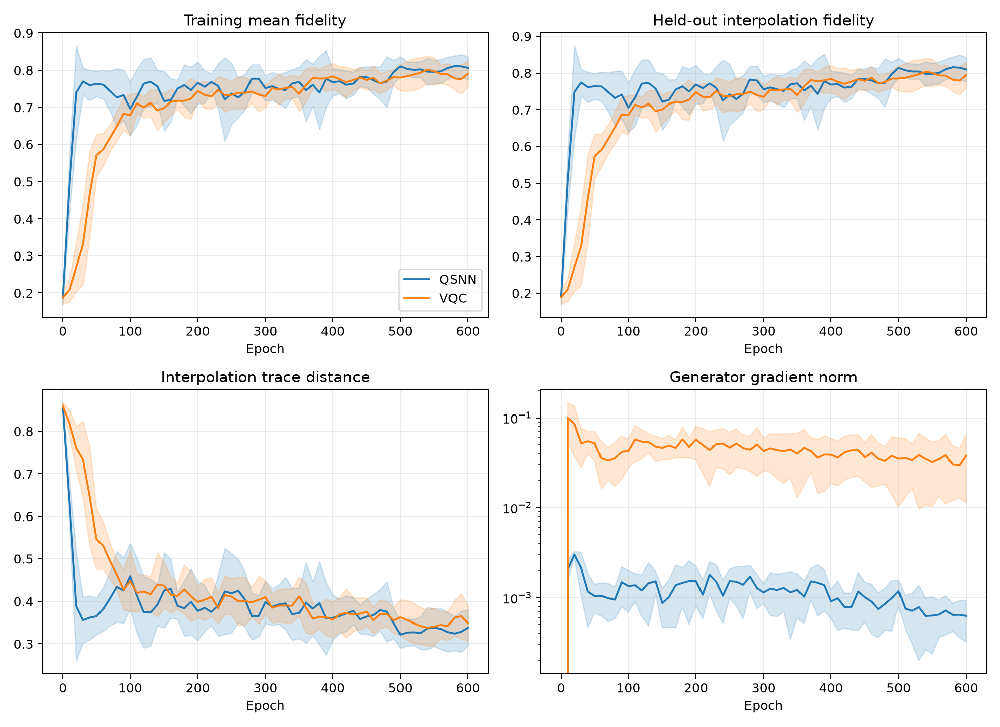
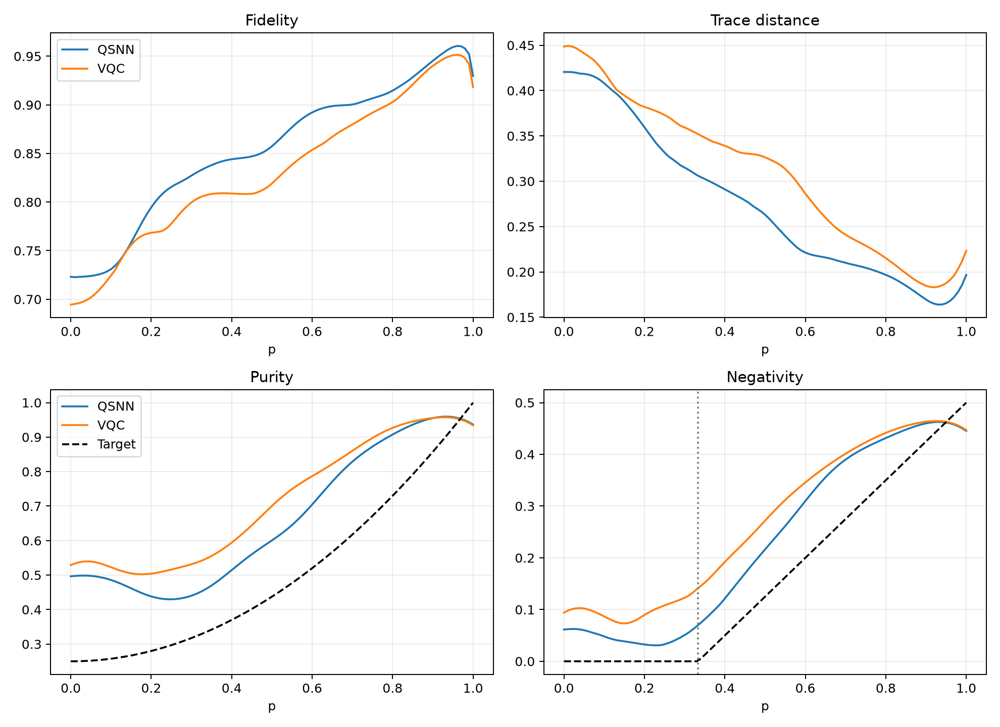

# 条件 Werner 态族 QSNN-GAN 对照实验报告

## 1. 研究问题

本实验研究在相同条件混合态生成器、配对初始化和训练预算下，条件 QSNN 判别器是否比参数量匹配的条件 ancilla-VQC 判别器更有利于学习连续映射

\[
p\longmapsto \rho_W(p)
=p|\Psi^+\rangle\langle\Psi^+|+(1-p)\frac{I_4}{4},
\qquad p\in[0,1],
\]

其中

\[
|\Psi^+\rangle=\frac{|01\rangle+|10\rangle}{\sqrt2}.
\]

本实验重点考察未见条件上的插值、整个连续区间上的最差性能、收敛速度，以及是否复现 Werner 态的纯度和纠缠性质。

## 2. 数据划分

| 集合 | 条件值 | 用途 |
|---|---|---|
| 训练集 | \(0,0.1,\ldots,1.0\) | GAN训练，共11点 |
| 验证集 | 0.025, 0.225, 0.425, 0.625, 0.825 | 选择历史最佳检查点 |
| 插值测试集 | \(0.05,0.15,\ldots,0.95\) | 未见条件泛化，共10点 |
| 边界测试集 | 0.28, 0.30, 0.32, 1/3, 0.35, 0.37, 0.40 | 纠缠边界诊断 |
| 稠密测试集 | \(0,0.01,\ldots,1.0\) | 101点全区间评估 |

测试集不参与训练，历史最佳检查点只根据独立验证集平均保真度选择。

## 3. 条件模型

### 3.1 条件纯化生成器

生成器在四量子比特上制备纯化态，然后对两个环境量子比特偏迹：

\[
\rho_G(p)=\operatorname{Tr}_E
\left[|\Phi_G(p)\rangle\langle\Phi_G(p)|\right].
\]

电路包含8层RY/RZ与交替方向环形CNOT。归一化条件 \(\tilde p=2p-1\) 在每层重上传：

\[
\theta_y^{(l,q)}(p)=\theta_{y,0}^{(l,q)}+\tilde p\,\theta_{y,1}^{(l,q)},
\]

\[
\theta_z^{(l,q)}(p)=\theta_{z,0}^{(l,q)}+\tilde p\,\theta_{z,1}^{(l,q)}.
\]

生成器共128个可训练参数，两组GAN使用完全相同的结构和配对初始参数。

### 3.2 条件QSNN判别器

判别器采用4-4-2分层结构，并同时条件化Hamiltonian和Lindblad速率：

\[
h_k(p)=h_{k,0}+\tilde p\,h_{k,1},
\]

\[
r_k(p)=\operatorname{softplus}(r_{k,0}+\tilde p\,r_{k,1}).
\]

基础参数和条件斜率合计92个。输入人口依次经过相干演化、输入到隐藏层耗散、隐藏到输出层耗散；输出节点为吸收端。未到达输出层的人口按随机猜测处理，避免条件归一化作弊。

由于Hamiltonian随条件变化，小规模实验采用条件Hamiltonian的精确矩阵指数。`cheby_suzuki`仍用于此前固定或非条件QSNN路径，本实验没有把同一组条件相关谱界强行用于Chebyshev展开。

### 3.3 条件VQC判别器

VQC使用两个系统量子比特和一个读出辅助比特，包含8层RY/RZ与环形CNOT。每个旋转角使用与QSNN相同的仿射条件重上传方式，共96个参数。最终读出构成完整二元测量，输出质量为1。

两种判别器参数量相差4.35%。

## 4. 训练设置

| 设置 | 数值 |
|---|---:|
| 配对随机种子 | 10个（0–9） |
| 训练轮数 | 600 |
| 每轮判别器更新 | 1 |
| 每轮生成器更新 | 3 |
| 条件批量 | 全部11个训练条件 |
| 初始生成器/判别器学习率 | 0.005 / 0.005 |
| 300轮后学习率 | 线性衰减至初始值的0.3倍 |
| EMA衰减 | 0.995 |
| 梯度裁剪 | 5.0 |
| 精度 | float64 / complex128 |
| shots和附加噪声 | 无 |

主指标使用“验证集选出的历史最佳生成器”。同时保存末轮生成器和EMA生成器，避免只展示有利检查点。

## 5. 容量预检

使用完全相同的条件生成器直接最小化训练点密度矩阵误差，10个种子的结果为：

| 指标 | 均值 ± 标准差 |
|---|---:|
| 训练点平均保真度 | 0.99829 ± 0.00017 |
| 插值点平均保真度 | 0.99994 ± 0.00002 |
| 101点最差保真度 | 0.98173 ± 0.00175 |
| 101点最大迹距离 | 0.01842 ± 0.00179 |

因此生成器能够表示并插值该条件Werner态族。GAN结果与容量上限之间的差距主要来自对抗训练，而不是生成器表达能力不足。

## 6. 正式结果

下表为验证集选优检查点在10个配对种子上的均值 ± 样本标准差：

| 指标 | QSNN-GAN | VQC-GAN | 结果 |
|---|---:|---:|---|
| 训练点平均保真度 ↑ | **0.85085 ± 0.01270** | 0.82811 ± 0.01362 | QSNN更高 |
| 未见插值平均保真度 ↑ | **0.85530 ± 0.01472** | 0.83217 ± 0.01403 | QSNN在10/10种子中更高 |
| 101点最差保真度 ↑ | **0.70727 ± 0.05314** | 0.67325 ± 0.03855 | QSNN更高 |
| 101点平均迹距离 ↓ | **0.27370 ± 0.02436** | 0.30833 ± 0.01565 | QSNN在10/10种子中更低 |
| 101点最大迹距离 ↓ | **0.44348 ± 0.04235** | 0.47083 ± 0.05644 | 差异不显著 |
| 纯度曲线MAE ↓ | **0.16353 ± 0.02842** | 0.21464 ± 0.03952 | QSNN更低 |
| Bell占据曲线MAE ↓ | **0.08505 ± 0.01523** | 0.10811 ± 0.04984 | 差异不显著 |
| Negativity曲线MAE ↓ | **0.07244 ± 0.02142** | 0.10547 ± 0.04647 | 差异未达双侧5%显著性 |
| Pauli关联MAE ↓ | **0.15211 ± 0.02453** | 0.16690 ± 0.06192 | 差异不显著 |
| 单种子训练时间 ↓ | **96.6 ± 8.4秒** | 139.5 ± 13.7秒 | 本机CPU模拟 |

配对检验结果：

- 插值平均保真度差 \(\Delta=+0.02313\)，配对t检验 \(p=0.00216\)，Wilcoxon \(p=0.00195\)；
- 101点最差保真度差 \(\Delta=+0.03402\)，配对t检验 \(p=0.03599\)，Wilcoxon \(p=0.04883\)；
- 101点平均迹距离差 \(\Delta=-0.03463\)，配对t检验 \(p=0.000929\)，Wilcoxon \(p=0.00195\)；
- 纯度MAE差 \(\Delta=-0.05111\)，配对t检验 \(p=0.00708\)，Wilcoxon \(p=0.00586\)。

这些结果支持：在当前理想模拟、当前架构和统一超参数下，条件QSNN判别器让生成器取得了更好的插值保真度、平均态距离和纯度曲线拟合。

## 7. 收敛速度

首次达到指定插值平均保真度所需轮数如下：

| 阈值 | QSNN-GAN | VQC-GAN | QSNN节省轮数 |
|---|---:|---:|---:|
| \(F\ge0.70\) | 21 ± 3 | 100 ± 11 | 79 |
| \(F\ge0.75\) | 24 ± 7 | 177 ± 42 | 153 |
| \(F\ge0.80\) | 48 ± 27 | 361 ± 91 | 313 |

三个阈值上QSNN均在10/10配对种子中更快，Wilcoxon检验均为 \(p=0.00195\)。这是本次实验中最明显的QSNN优势：条件QSNN为生成器提供了显著更快的早期学习信号。

训练曲线：



## 8. 稠密条件曲线



平均曲线显示：

- QSNN在大部分 \(p\) 区间具有更高保真度和更低迹距离；
- 两组在 \(p\approx0\) 附近最困难，QSNN最差均值约0.723，VQC约0.694；
- 在 \(p=1\) 端点，QSNN平均保真度约0.930，VQC约0.918；
- 两组都没有准确复现低 \(p\) 区域的纯度和纠缠结构。

理论端点距离为

\[
D_{\mathrm{tr}}(\rho_W(0),\rho_W(1))=0.75.
\]

生成结果为QSNN \(0.725\pm0.153\)，VQC \(0.689\pm0.120\)。两组均没有发生“所有条件输出完全相同”的严重条件坍塌，但局部条件敏感度偏高，生成轨迹比理论直线更曲折。

## 9. 纠缠边界没有被正确学习

Werner态的理论negativity为

\[
\mathcal N(\rho_W(p))=\max\left(0,\frac{3p-1}{4}\right),
\]

因此 \(p\le1/3\) 应当完全可分。

但验证选优生成器通常在 \(p=0\) 就产生正negativity：QSNN估计边界的平均误差为0.306，VQC为0.332。QSNN的negativity曲线MAE较低，但仍没有学到正确的 \(p=1/3\) 转变。

这说明：

1. 平均保真度0.83–0.86不足以保证纠缠性质正确；
2. 当前对抗目标更容易匹配总体密度矩阵方向，而没有严格约束低 \(p\) 区域的可分性；
3. 本实验能支持“QSNN提高条件生成质量与收敛速度”，不能支持“QSNN-GAN已经学会Werner纠缠相变”。

若纠缠边界是核心目标，后续应加入边界附近条件加权、物理可观测量辅助损失，或采用我们此前讨论的对抗式纠缠见证任务。

## 10. 末轮、EMA与历史最佳

| 插值平均保真度 | QSNN-GAN | VQC-GAN |
|---|---:|---:|
| 验证集选优 | **0.85530 ± 0.01472** | 0.83217 ± 0.01403 |
| 600轮末轮 | 0.80988 ± 0.03287 | 0.79472 ± 0.03554 |
| EMA | 0.84073 ± 0.01769 | 0.84000 ± 0.02058 |

验证选优时QSNN优势显著；末轮和EMA差异均不显著。两种GAN仍存在后期振荡或从最佳点回落，因此部署或后续比较必须保存独立验证集最佳检查点，不能只使用最后一轮。

## 11. 物理性与软件验证

- 所有生成态均保持迹为1、Hermitian且半正定；
- 验证选优生成态最大迹漂移为 \(6.66\times10^{-16}\)；
- Hermitian漂移为0；
- 稠密网格最小特征值大于 \(1.04\times10^{-6}\)；
- QSNN最终平均输出占据率为0.817，约18.3%人口仍停留在非输出节点并按随机猜测处理；
- VQC完整读出占据率为1；
- 项目测试套件共46项，全部通过。

## 12. 当前结论

在本次条件Werner态族实验中，QSNN-GAN表现出了比VQC-GAN更明确的优势：

1. 未见插值平均保真度在10/10个配对种子中更高；
2. 101点平均迹距离在10/10个配对种子中更低；
3. 最差条件保真度和纯度曲线误差显著改善；
4. 达到0.70、0.75和0.80插值保真度的速度大幅领先；
5. 本机小矩阵CPU模拟时间更短。

但结论范围必须限定为：

> 在当前参数匹配、相同训练预算、无shots和无噪声的数值实验中，条件QSNN判别器改善了Werner态族的整体插值生成质量和收敛速度。

当前还不能声称量子优势、硬件优势或通用混合态生成优势，也不能声称模型已经正确学习纠缠临界点。仍需公平超参数搜索、更多种子、有限shots、噪声和更复杂状态族验证。

## 13. 下一步建议

1. 在 \(p\in[0,0.4]\) 尤其是 \(p=1/3\) 附近提高训练条件权重；
2. 增加小权重纯度、Bell占据或Pauli关联辅助损失，单独报告纯GAN和混合损失；
3. 对两类判别器进行相同预算的学习率和更新比例搜索；
4. 加入shots和噪声，验证QSNN的早期优势是否保持；
5. 扩展到随机局域旋转Werner态族，避免任务只沿固定Bell基的一维直线变化；
6. 开展对抗式纠缠见证任务，直接优化边界识别而非依赖生成保真度间接恢复边界。

## 14. 复现命令与产物

在项目根目录的`qsnn`环境中运行：

```powershell
$env:OMP_NUM_THREADS='1'
$env:MKL_NUM_THREADS='1'
D:\anaconda\envs\qsnn\python.exe scripts\run_conditional_werner_qgan.py `
  --config configs\conditional_werner_family.yaml `
  --epochs 600 `
  --capacity-steps 1500 `
  --seeds 0 1 2 3 4 5 6 7 8 9 `
  --device cpu `
  --output-dir outputs\qgan\conditional_werner_family
```

主要产物：

- `summary.json`：汇总统计；
- `final_metrics.csv`：每个种子的final/best/EMA评估；
- `training_metrics.csv`：逐轮训练、验证和插值指标；
- `dense_metrics.csv`：101点逐条件物理指标；
- `capacity_check.csv`：条件生成器容量预检；
- `training_curves.png`：训练曲线；
- `dense_condition_curves.png`：连续条件物理曲线；
- `qsnn_seed*.pt`、`vqc_seed*.pt`：包含final/best/EMA的模型检查点。
