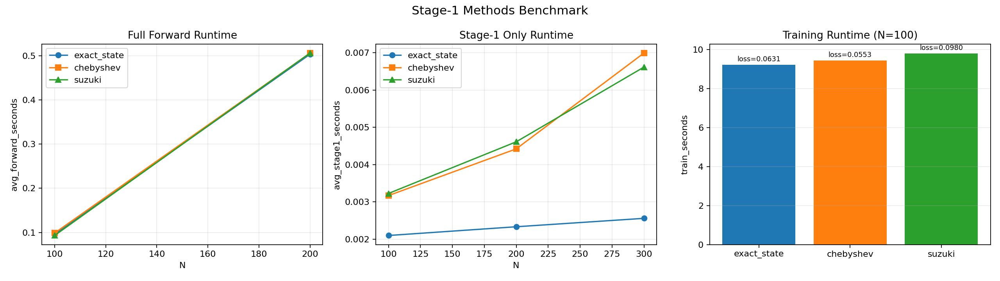
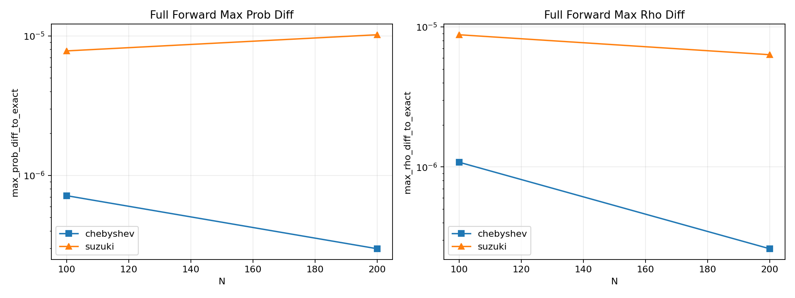
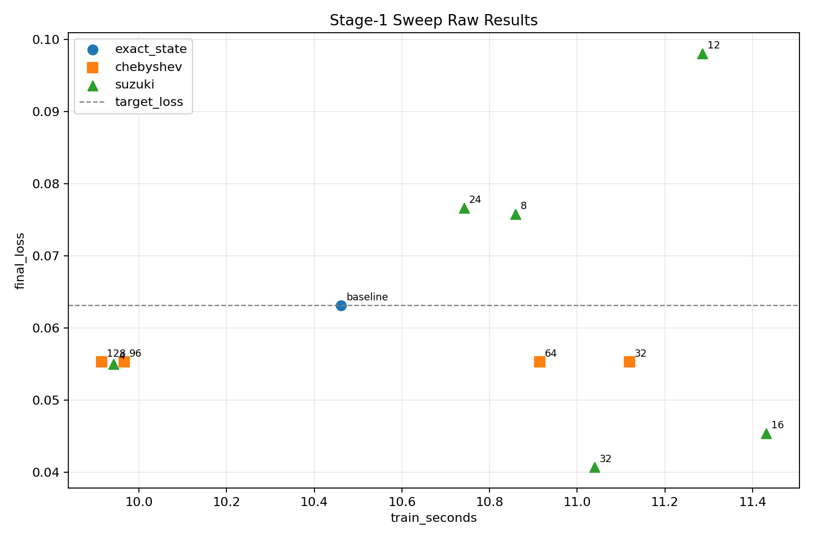
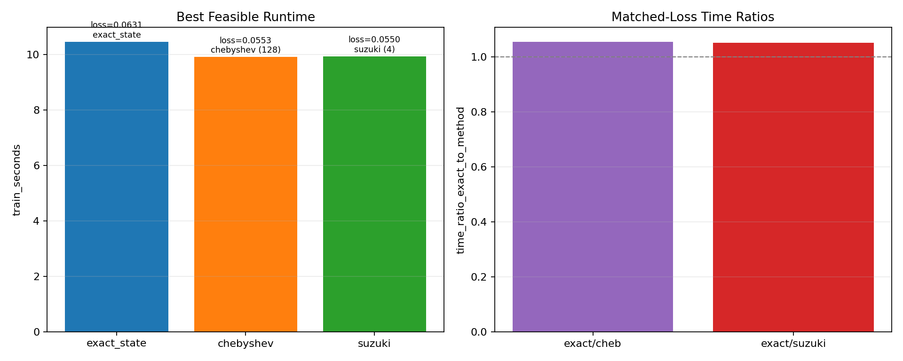
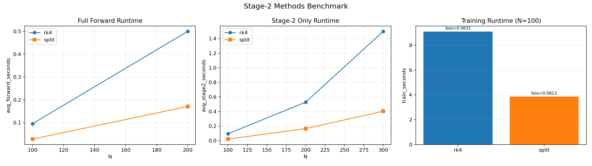
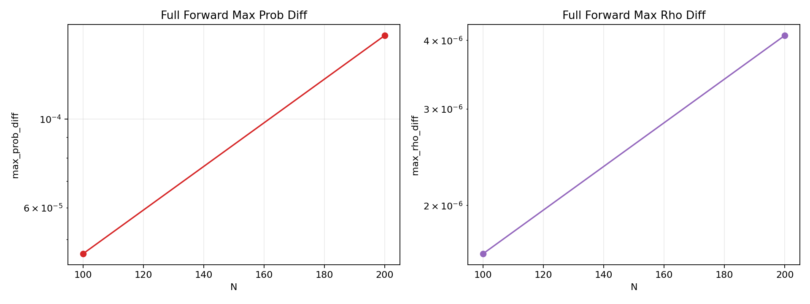
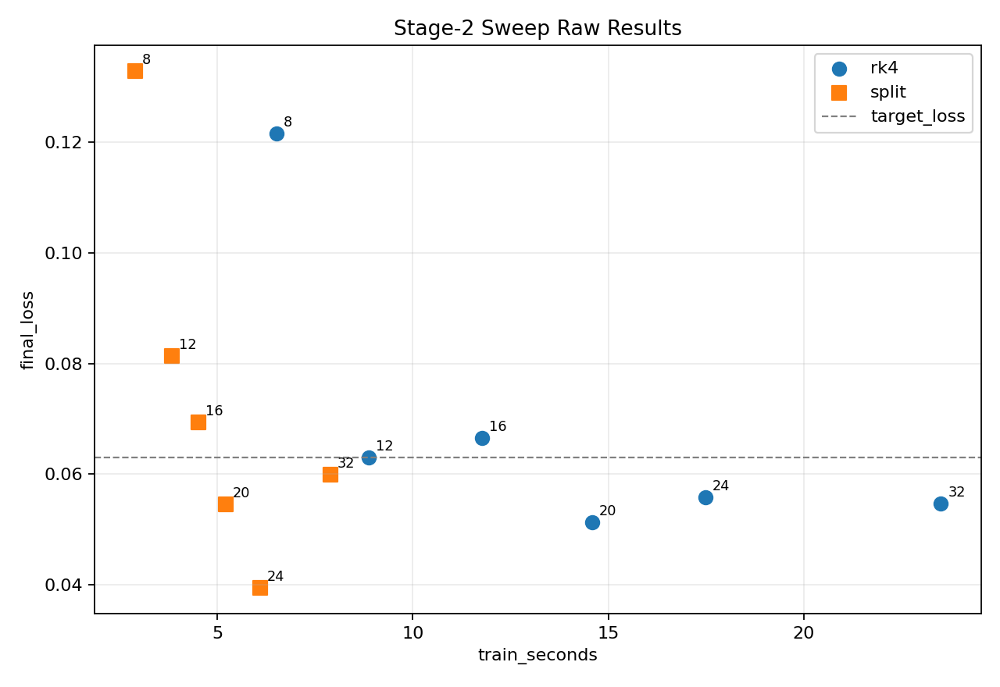
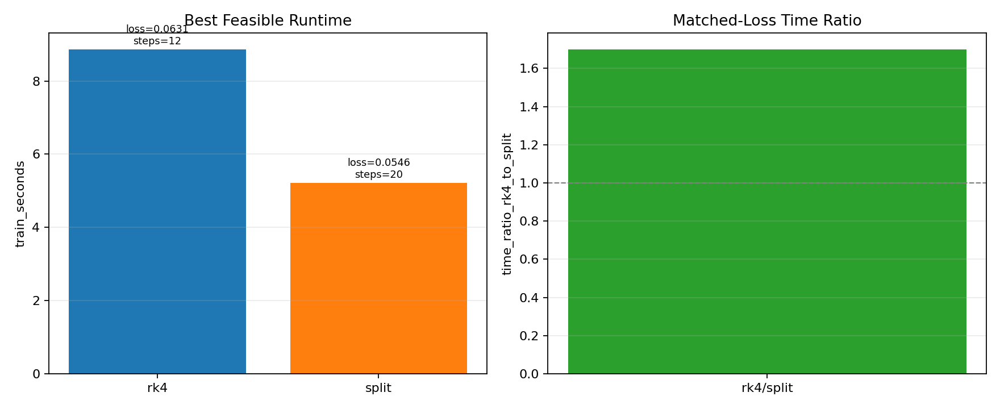
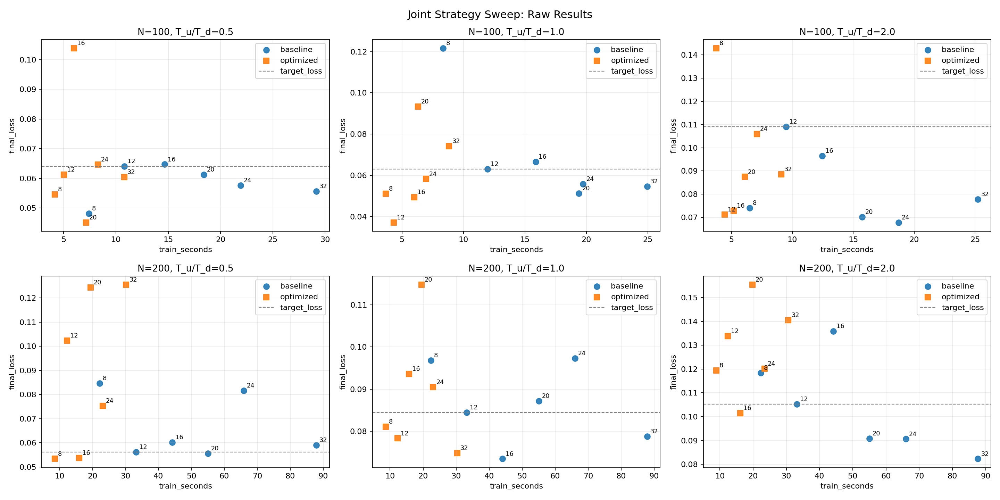
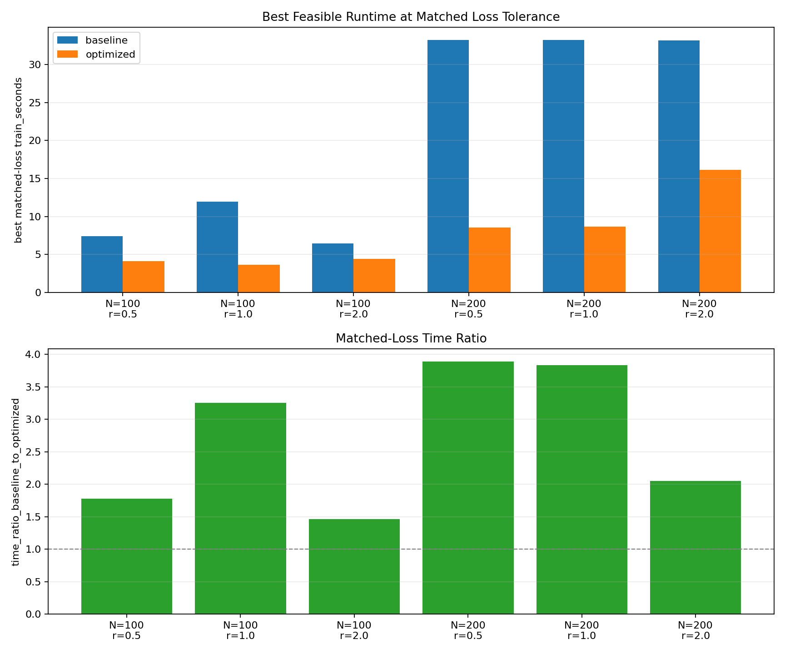

# Chebyshev Comparison 总结报告

## 1. 报告目的

本报告汇总 `experiments/chebyshev_comparision/results/` 下当前全部 benchmark 与绘图结果，回答四个问题：

1. `Stage-1` 中，`exact_state`、`chebyshev`、`suzuki` 谁更快，误差如何
2. `Stage-1` 在“同等 loss 精度”口径下，近似方法是否比 `exact_state` 更省时
3. `Stage-2` 中，原始 `rk4` 与新增 `split` 谁更快，是否能在同精度下仍然更快
4. 当把“文档启发的两项优化”联合起来后，相对于基线策略，在不同 `N` 和 `T_u/T_d` 下是否更有优势

本报告使用的结果文件与图片如下：

- `benchmark_stage1_methods_results.json`
- `benchmark_stage1_methods_results_2.json`
- `benchmark_stage1_sweep_loss_target_results.json`
- `benchmark_stage2_methods_results.json`
- `benchmark_stage2_sweep_loss_target_results.json`
- `benchmark_joint_methods_sweep_loss_target_results.json`
- `benchmark_stage1_methods_runtime.png`
- `benchmark_stage1_methods_error.png`
- `benchmark_stage1_sweep_loss_target_raw.png`
- `benchmark_stage1_sweep_loss_target_summary.png`
- `benchmark_stage2_methods_runtime.png`
- `benchmark_stage2_methods_error.png`
- `benchmark_stage2_sweep_loss_target_raw.png`
- `benchmark_stage2_sweep_loss_target_summary.png`
- `benchmark_joint_methods_sweep_raw.png`
- `benchmark_joint_methods_sweep_summary.png`

---

## 2. 对比口径

### 2.1 Stage-1 方法

- `exact_state`
  - 先对纯态做精确幺正演化
  - `psi_u = exp(-iHT_u) psi`
  - 再重建 `rho_u = psi_u psi_u^\dagger`
- `chebyshev`
  - 用 Chebyshev 递推近似 `exp(-iHT_u) psi`
  - 再重建密度矩阵
- `suzuki`
  - 用 Suzuki 分裂近似纯态演化
  - 当前 sweep 中主要扫 `stage1_suzuki_steps`

### 2.2 Stage-2 方法

- `rk4`
  - 原始结构化耗散演化器
- `split`
  - 对称 splitting
  - 形式为“半步相干 + 一整步结构化耗散 + 半步相干”

### 2.3 联合策略

- `baseline`
  - `stage1 = exact_state`
  - `stage2 = rk4`
- `optimized`
  - `stage1 = chebyshev`
  - `stage2 = split`

### 2.4 “同等 loss 精度”定义

统一使用：

- 基线参考配置的 `final_loss` 作为 `target_loss`
- 容差 `eps = 0.002`
- 只要某配置满足
  - `final_loss <= target_loss + eps`
  即视为 feasible
- 在所有 feasible 配置中，训练耗时最小的一项记为 `best feasible runtime`

这一定义的含义是：

- 不是比较“谁绝对最快”
- 而是比较“谁在达到同等训练效果要求时最快”

---

## 3. 总结结论

先给整体结论：

1. `Stage-1` 的 `chebyshev` 和 `suzuki` 在当前实现下都没有在原始 forward benchmark 中稳定优于 `exact_state`
2. `Stage-1` 的单段演化里，`exact_state` 依然是最稳妥的默认实现
3. 但在训练层面的 matched-loss sweep 中，`chebyshev` 和 `suzuki` 各自都能找到比 `exact_state` 更便宜的配置
4. `Stage-2 split` 的优势最明确
5. `Stage-2 split` 不仅在固定步数下快很多，在 matched-loss 口径下依然更快
6. 联合策略 `chebyshev + split` 相对 `exact_state + rk4` 在所有已测 `(N, T_u/T_d)` 条件下都更快
7. 目前“真正确定值得保留的优化”是 `Stage-2 split`；`Stage-1` 的近似方法更适合作为可调对照与任务依赖型优化选项，而不是无条件替代 `exact_state`

---

## 4. Stage-1 原始基准

这一部分对应：

- `benchmark_stage1_methods_results.json`
- `benchmark_stage1_methods_results_2.json`

其中：

- 第一份结果是 `exact_state vs chebyshev`
- 第二份结果扩展到了 `exact_state vs chebyshev vs suzuki`

### 4.1 运行时间与误差图

### 4.2 `exact_state` vs `chebyshev`

原始 `Stage-1 only` 结果：

- `N=100`
  - `exact_state = 0.002213s`
  - `chebyshev = 0.003180s`
  - `time_ratio_exact_to_chebyshev = 0.696`
- `N=200`
  - `exact_state = 0.002359s`
  - `chebyshev = 0.004423s`
  - `time_ratio_exact_to_chebyshev = 0.533`
- `N=300`
  - `exact_state = 0.002585s`
  - `chebyshev = 0.006538s`
  - `time_ratio_exact_to_chebyshev = 0.395`

对应数值误差：

- `max_rho_diff` 始终在 `1e-6 ~ 1e-6` 到 `1e-6 ~ 1e-5` 的低量级
- 说明 `chebyshev` 数值上是可信近似，但速度没有赢

### 4.3 加入 `suzuki` 后的对比

在 `benchmark_stage1_methods_results_2.json` 中：

- `N=100`
  - `exact_state = 0.002101s`
  - `chebyshev = 0.003171s`
  - `suzuki = 0.003227s`
- `N=200`
  - `exact_state = 0.002335s`
  - `chebyshev = 0.004421s`
  - `suzuki = 0.004611s`
- `N=300`
  - `exact_state = 0.002560s`
  - `chebyshev = 0.006990s`
  - `suzuki = 0.006613s`

可以看到：

- `exact_state` 在 `Stage-1 only` 中始终最快
- `suzuki` 没有形成明显速度优势
- `suzuki` 的状态误差也大于 `chebyshev`
  - 例如 `N=300` 时
  - `chebyshev max_rho_diff_to_exact = 3.25e-06`
  - `suzuki max_rho_diff_to_exact = 4.05e-05`

### 4.4 对全模型和训练的影响

在三方法训练 benchmark 中：

- `exact_state = 9.219s, final_loss = 0.06308`
- `chebyshev = 9.440s, final_loss = 0.05525`
- `suzuki = 9.806s, final_loss = 0.09802`

这里应注意：

- 训练时间差异不算巨大
- `suzuki` 在当前默认参数下训练效果明显更差
- `chebyshev` 的最终 loss 更低，但单次 seed 不能直接说明其泛化一定更好

### 4.5 对 Stage-1 的判断

就当前实现与当前测试规模而言：

- `exact_state` 是最稳妥的默认方法
- `chebyshev` 数值上可信，但原始 benchmark 下没有速度优势
- `suzuki` 在默认参数下既不更快，也没有更稳定的效果

根因大致是：

- `exact_state` 依赖 GPU 上高度优化的 `matrix_exp`
- `chebyshev` 仍有 Python 层递推开销
- `suzuki` 需要多步分裂推进，当前 `H` 又不是特别适合这种拆分

---

## 5. Stage-1 同等 loss 精度结果

这一部分对应：

- `benchmark_stage1_sweep_loss_target_results.json`

配置为：

- `N = 100`
- `train_steps = 100`
- `stage2_method = rk4`
- `stage2_steps = 12`
- `target_loss = exact_state 的 final_loss = 0.06308075`
- `eps = 0.002`

### 5.1 结果图

### 5.2 原始结果

基线：

- `exact_state`
  - `train_seconds = 10.462s`
  - `final_loss = 0.063081`

Chebyshev sweep：

- `order=32`：`11.119s`, `0.055252`
- `order=64`：`10.914s`, `0.055252`
- `order=96`：`9.967s`, `0.055252`
- `order=128`：`9.915s`, `0.055252`

Suzuki sweep：

- `steps=4`：`9.943s`, `0.054970`
- `steps=8`：`10.859s`, `0.075731`
- `steps=12`：`11.285s`, `0.098022`
- `steps=16`：`11.431s`, `0.045396`
- `steps=24`：`10.742s`, `0.076601`
- `steps=32`：`11.039s`, `0.040652`

### 5.3 Best feasible runtime

在满足 `final_loss <= 0.065081` 的条件下：

- `best_exact_state`
  - `10.462s`
- `best_chebyshev`
  - `order=128`
  - `9.915s`
- `best_suzuki`
  - `steps=4`
  - `9.943s`

这说明：

- 虽然原始 `Stage-1 only` benchmark 里 `exact_state` 更快
- 但在训练任务层面，近似方法可以借由更便宜的参数配置找到更好的“精度-速度折中点”

这里 `best feasible runtime` 更高的 `exact_state` 并不矛盾，因为：

- `exact_state` 在这个脚本里只有 1 个固定配置
- `chebyshev` 和 `suzuki` 则分别扫了多个 `order` 或 `steps`
- 因而它们有机会找到比基线更便宜、但仍满足 loss 容差的配置

### 5.4 对 Stage-1 matched-loss 的判断

结论应谨慎表述：

- 从“单段演化速度”看，`exact_state` 仍最好
- 从“训练达到相同 loss 的最小耗时”看，`chebyshev` 与 `suzuki` 都出现了略优于 `exact_state` 的配置
- 但这种优势目前只在 `N=100`、单个 seed、固定 `stage2=rk4` 的条件下得到

因此更合理的工程判断是：

- `exact_state` 继续作为默认实现
- `chebyshev`、`suzuki` 保留为可调研究选项
- 如果后续继续扫更多 `N`、更多 seed，它们有可能在特定任务条件下成为更便宜的 Stage-1 近似器

---

## 6. Stage-2 原始基准

这一部分对应：

- `benchmark_stage2_methods_results.json`

### 6.1 结果图

### 6.2 固定步数结果

`Stage-2 only`：

- `N=100`
  - `rk4 = 0.094165s`
  - `split = 0.021216s`
  - `time_ratio_rk4_to_split = 4.438`
- `N=200`
  - `rk4 = 0.527974s`
  - `split = 0.164871s`
  - `time_ratio_rk4_to_split = 3.202`
- `N=300`
  - `rk4 = 1.499477s`
  - `split = 0.404117s`
  - `time_ratio_rk4_to_split = 3.711`

全模型前向：

- `N=100`
  - `rk4 = 0.095639s`
  - `split = 0.028171s`
  - `time_ratio_rk4_to_split = 3.395`
- `N=200`
  - `rk4 = 0.500063s`
  - `split = 0.171161s`
  - `time_ratio_rk4_to_split = 2.922`

训练：

- `rk4 = 9.092s`, `final_loss = 0.063081`
- `split = 3.853s`, `final_loss = 0.081333`

### 6.3 误差观察

误差量级：

- `Stage-2 only max_rho_diff`
  - `2.33e-06 ~ 4.08e-06`
- 全模型 `max_prob_diff`
  - `4.60e-05 ~ 1.62e-04`

这说明：

- `split` 的数值轨迹与 `rk4` 非完全相同
- 但状态差异仍然较小
- 训练时的 loss 差异主要来自数值积分路径变化，而不是明显失稳

### 6.4 对 Stage-2 原始 benchmark 的判断

结论非常明确：

- `split` 在速度上显著优于 `rk4`
- 优势稳定在约 `3x` 左右
- 这一优势在 `Stage-2 only`、全模型前向、训练三种口径下都成立

---

## 7. Stage-2 同等 loss 精度结果

这一部分对应：

- `benchmark_stage2_sweep_loss_target_results.json`

### 7.1 结果图

### 7.2 原始 sweep

基线：

- `rk4, steps=12`
  - `8.868s`
  - `0.063081`

`split`：

- `steps=8`
  - `2.899s`
  - `0.132811`
- `steps=12`
  - `3.847s`
  - `0.081333`
- `steps=16`
  - `4.517s`
  - `0.069349`
- `steps=20`
  - `5.217s`
  - `0.054602`
- `steps=24`
  - `6.094s`
  - `0.039496`
- `steps=32`
  - `7.893s`
  - `0.059874`

### 7.3 Best feasible runtime

在满足 `final_loss <= 0.065081` 的条件下：

- `best_rk4`
  - `steps=12`
  - `8.868s`
- `best_split`
  - `steps=20`
  - `5.217s`

对应时间比：

- `time_ratio_rk4_to_split = 1.700`

### 7.4 对 Stage-2 matched-loss 的判断

这部分是整份报告里最强的证据之一：

- `split` 不是单纯靠“牺牲精度”换速度
- 当我们强制要求达到与基线近似相同的训练效果时，`split` 依然更快

这意味着：

- `Stage-2 split` 具有真实的精度-速度优势
- 它是当前最值得纳入默认主线的优化项

---

## 8. 联合策略同等 loss 结果

这一部分对应：

- `benchmark_joint_methods_sweep_loss_target_results.json`

### 8.1 结果图

### 8.2 各 case 最优结果

#### N=100, T_u/T_d=0.5

- `best_baseline`
  - `stage2_steps=8`
  - `train_seconds=7.392`
  - `final_loss=0.048190`
- `best_optimized`
  - `stage2_steps=8`
  - `train_seconds=4.157`
  - `final_loss=0.054621`
- `time_ratio_baseline_to_optimized = 1.778`

#### N=100, T_u/T_d=1.0

- `best_baseline`
  - `stage2_steps=12`
  - `train_seconds=11.963`
  - `final_loss=0.063081`
- `best_optimized`
  - `stage2_steps=8`
  - `train_seconds=3.677`
  - `final_loss=0.051018`
- `time_ratio_baseline_to_optimized = 3.253`

#### N=100, T_u/T_d=2.0

- `best_baseline`
  - `stage2_steps=8`
  - `train_seconds=6.480`
  - `final_loss=0.074006`
- `best_optimized`
  - `stage2_steps=12`
  - `train_seconds=4.428`
  - `final_loss=0.071240`
- `time_ratio_baseline_to_optimized = 1.464`

#### N=200, T_u/T_d=0.5

- `best_baseline`
  - `stage2_steps=12`
  - `train_seconds=33.241`
  - `final_loss=0.056111`
- `best_optimized`
  - `stage2_steps=8`
  - `train_seconds=8.540`
  - `final_loss=0.053347`
- `time_ratio_baseline_to_optimized = 3.892`

#### N=200, T_u/T_d=1.0

- `best_baseline`
  - `stage2_steps=12`
  - `train_seconds=33.212`
  - `final_loss=0.084423`
- `best_optimized`
  - `stage2_steps=8`
  - `train_seconds=8.669`
  - `final_loss=0.081015`
- `time_ratio_baseline_to_optimized = 3.831`

#### N=200, T_u/T_d=2.0

- `best_baseline`
  - `stage2_steps=12`
  - `train_seconds=33.133`
  - `final_loss=0.105231`
- `best_optimized`
  - `stage2_steps=16`
  - `train_seconds=16.152`
  - `final_loss=0.101481`
- `time_ratio_baseline_to_optimized = 2.051`

### 8.3 联合策略结论

在所有已测试的六个 case 中：

- `optimized = chebyshev + split`
  都比
- `baseline = exact_state + rk4`
  更快

并且优势很明显：

- 最低约 `1.46x`
- 最高接近 `3.89x`

但这里需要特别指出：

- 联合策略中的主要收益来源，几乎可以确定是 `Stage-2 split`
- `Stage-1 chebyshev` 本身并没有在单独 benchmark 中证明其绝对速度优势

因此联合策略更快，不应简单归因于“Stage-1 和 Stage-2 两项优化都同样有效”，而应理解为：

- `Stage-2 split` 提供了主导性收益
- `Stage-1 chebyshev` 在联合方案里没有成为明显拖累，并且在 matched-loss 口径下还能找到可接受配置

---

## 9. 对当前实现的综合判断

### 9.1 已经明确成立的结论

- `Stage-1 exact_state` 是当前最稳妥的默认实现
- `Stage-2 split` 是当前最明确、最值得保留的加速优化
- 在 matched-loss 口径下，`split` 依然快于 `rk4`
- 联合策略在现有全部 case 中都优于基线

### 9.2 需要谨慎理解的部分

- `Stage-1 chebyshev` 并没有在原始 forward / stage-only benchmark 中跑赢 `exact_state`
- `Stage-1 suzuki` 目前也没有在原始 benchmark 中体现出稳定优势
- `Stage-1 matched-loss sweep` 中的优势幅度不大，而且只测了 `N=100`、单 seed
- 因此不能据此直接得出“Stage-1 近似方法已经应默认替换 exact_state”

### 9.3 为什么会出现这种现象

原因并不矛盾：

- 单段演化 benchmark 测的是算子本身的纯数值效率
- matched-loss sweep 测的是“训练任务里达到同样 loss 的总代价”

后者会同时受到以下因素影响：

- 优化路径差异
- 数值近似带来的训练轨迹变化
- 超参数扫描带来的可调空间

所以一个方法即使单次算子更慢，也可能在训练任务里通过更好的可调配置得到更低的 matched-loss 总耗时。

---

## 10. 工程建议

### 10.1 默认主线建议

如果要给出当前最稳妥的默认配置，建议是：

- `stage1 = exact_state`
- `stage2 = split`

原因：

- `Stage-1` 上，`exact_state` 证据最充分、实现最简单、行为最稳定
- `Stage-2` 上，`split` 已经在固定步数和同精度两种口径下都证明更优

### 10.2 研究性选项建议

以下方法建议保留为研究或对照分支：

- `stage1 = chebyshev`
- `stage1 = suzuki`

它们当前更适合用于：

- task-specific sweep
- 更大 `N`
- 更多 seed
- 更复杂 `T_u/T_d` 条件

### 10.3 后续最值得继续做的事

优先级建议如下：

1. 扩大 `Stage-1 matched-loss sweep`
   - 扫更多 `N`
   - 扫更多 seed
   - 分别在 `stage2=rk4` 和 `stage2=split` 下重复
2. 继续扩大联合策略 sweep
   - 更大的 `N`
   - 更广的 `T_u/T_d`
3. 如果继续深挖 `chebyshev`
   - 优化 Python 递推开销
   - 尝试缓存和更积极的截断
4. 如果继续深挖 `suzuki`
   - 扫更合理的分裂步数与阶数
   - 观察其在更大规模下是否出现更好的区间

---

## 11. 最终结论

基于当前全部结果，可以得出以下最终判断：

- `Stage-2 split` 是已被充分验证的有效优化
- `Stage-1 exact_state` 仍是当前最稳妥默认方法
- `Stage-1 chebyshev` 与 `suzuki` 在训练 matched-loss 口径下展现出一定潜力，但证据还不足以全面替代 `exact_state`
- 联合优化策略整体上优于原始基线策略，但其主要收益来源是 `Stage-2 split`

因此，当前项目最合理的工程落点是：

- 默认使用 `exact_state + split`
- 保留 `chebyshev` 与 `suzuki` 作为可调、可继续研究的 Stage-1 替代方案
