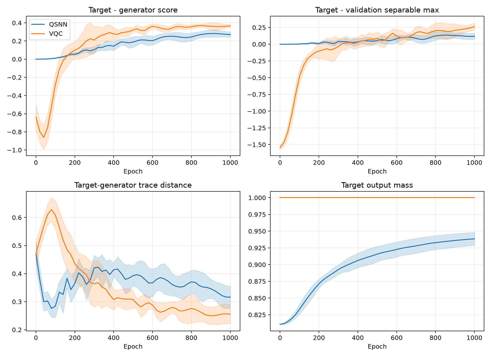
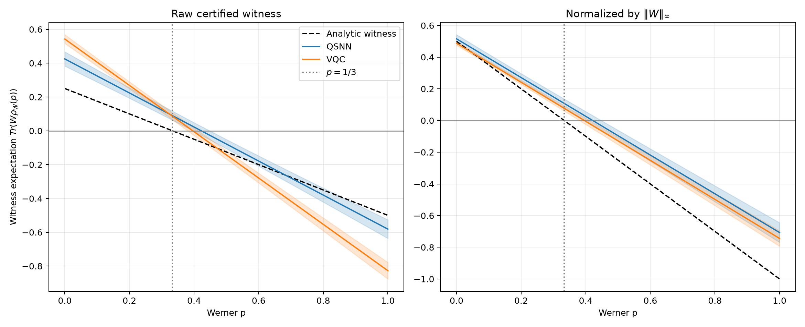
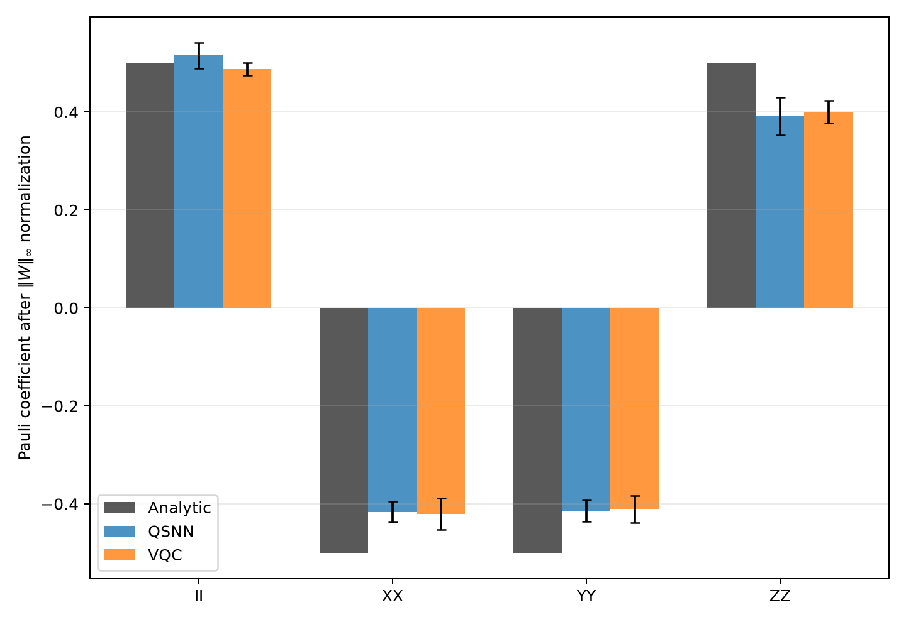
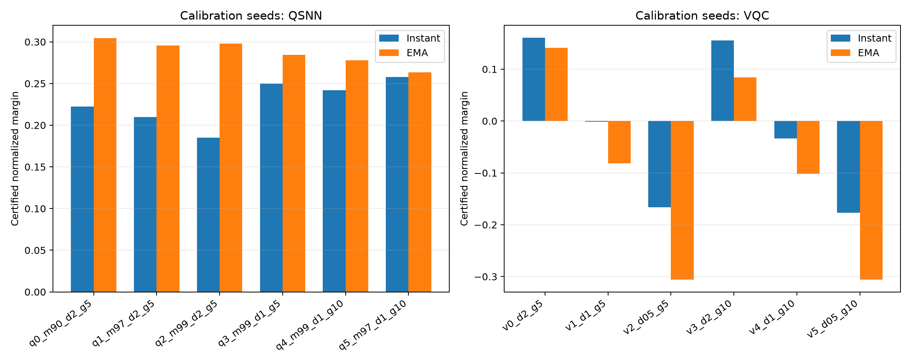
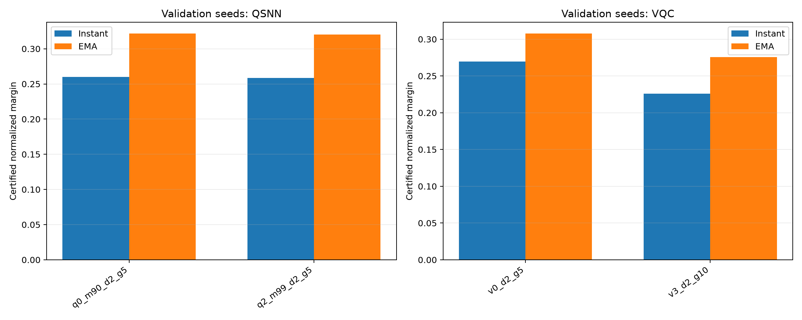
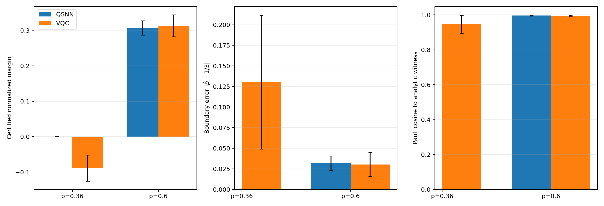
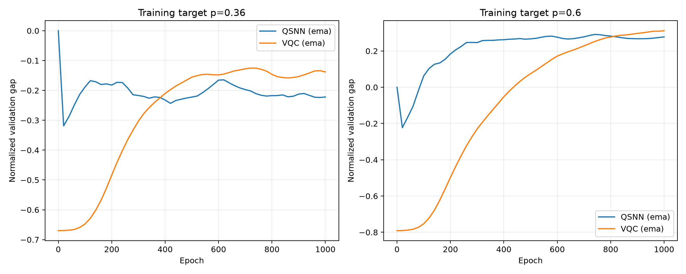
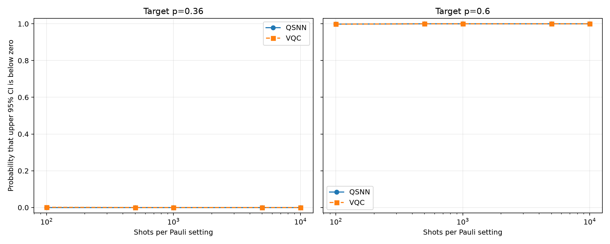

# QSNN–QGAN 纠缠见证对抗实验报告

日期：2026-08-15

## 1. 摘要

本实验实现并运行了一个“可分态生成器—量子判别器”的纠缠见证对抗任务。目标态为二量子比特混合纠缠态

\[
\rho_{\mathrm{target}}=\rho_W(0.6)
=0.6|\Psi^+\rangle\langle\Psi^+|+0.4\frac{I_4}{4}.
\]

生成器被严格限制为只能输出可分态；QSNN 或 VQC 判别器学习线性评分

\[
s_\phi(\rho)=\operatorname{Tr}(O_\phi\rho).
\]

训练后对所有二量子比特乘积态的最大评分进行独立全局上界校准，构造

\[
W_\phi=c_{\mathrm{sep}}I-O_\phi,
\]

从而保证该算符对所有可分态非负。正式实验使用 10 个配对随机种子、1000 个 epoch、完全相同的可分态生成器，并比较 46 参数 QSNN 与 48 参数 ancilla-VQC 判别器。

主要结果如下：

1. QSNN 和 VQC 均在 10/10 个随机种子上成功得到经过全局上界认证的纠缠见证；
2. 两者学到的 Pauli 方向都非常接近解析 Werner 见证，余弦相似度分别为 \(0.98699\pm0.00657\) 和 \(0.99010\pm0.00392\)；
3. VQC 的原始认证间隔显著大于 QSNN，且 10/10 个配对种子均更高；
4. 对见证算符谱范数归一化后，VQC 仍数值较高，但差异未达到双侧 5% 显著性；
5. VQC 恢复的 Werner 纠缠边界更接近理论值 \(p=1/3\)；
6. QSNN 更早产生较小的正验证间隔，但 VQC 在中后期形成了更强的见证；
7. 因此，本次实验成功验证了任务和见证认证流程，但**没有证明 QSNN 在最终纠缠见证质量上优于 VQC**。在当前配置下，VQC 的最终结果更好。

## 2. 数学任务

### 2.1 目标 Werner 态

使用

\[
|\Psi^+\rangle=\frac{|01\rangle+|10\rangle}{\sqrt2},
\]

以及

\[
\rho_W(p)=p|\Psi^+\rangle\langle\Psi^+|+(1-p)\frac{I_4}{4}.
\]

Werner 态在

\[
p>\frac13
\]

时纠缠。本实验主目标取 \(p=0.6\)，其 negativity 为 0.2。

### 2.2 解析纠缠见证

理论见证为

\[
W_*=\frac12I_4-|\Psi^+\rangle\langle\Psi^+|
=\frac14(II-XX-YY+ZZ).
\]

其在 Werner 态上的期望值为

\[
\operatorname{Tr}[W_*\rho_W(p)]=\frac{1-3p}{4}.
\]

因此

\[
\operatorname{Tr}[W_*\rho_W(0.6)]=-0.2,
\]

并在 \(p=1/3\) 处精确过零。

### 2.3 可分态生成器

生成器输出

\[
\sigma_G(\theta)=\sum_{k=1}^{16}q_k
|a_kb_k\rangle\langle a_kb_k|,
\]

其中 \(q_k\) 由 softmax 参数化，每个 \(|a_k\rangle\) 和 \(|b_k\rangle\) 是单量子比特纯态。由于输出始终是乘积纯态的凸组合，故

\[
\sigma_G(\theta)\in\mathcal S_{\mathrm{sep}}
\]

对所有参数严格成立。

### 2.4 对抗目标

判别器最大化

\[
\mathcal J_D
=s_\phi(\rho_{\mathrm{target}})-s_\phi(\sigma_G),
\]

生成器最大化

\[
\mathcal J_G=s_\phi(\sigma_G).
\]

因此，判别器寻找目标态与当前可分态之间的分离方向，生成器寻找该方向下最难区分的可分反例。

## 3. 见证提取与独立认证

### 3.1 线性读出

两种判别器均使用未归一化的线性读出

\[
z=p_{\mathrm{real}}-p_{\mathrm{fake}}.
\]

本实验没有使用含状态依赖分母的条件归一化概率，否则评分不再是密度矩阵的线性泛函，不能直接构造 Hermitian 纠缠见证。

通过 16 个物理纯态探针重建有效输入算符 \(O_\phi\)。对四个 Werner 探针状态直接计算的判别器输出与

\[
\operatorname{Tr}(O_\phi\rho)
\]

重建值之间的最大误差为：

| 模型 | 最大线性重建误差 |
|---|---:|
| QSNN | \((2.69\pm1.03)\times10^{-16}\) |
| VQC | \((2.39\pm0.91)\times10^{-16}\) |

这确认了最终使用的确实是线性见证，而不是一般非线性分类分数。

### 3.2 可分态全局上界

任意二量子比特 Hermitian 算符可以写成

\[
O=\alpha II+\boldsymbol a\cdot\boldsymbol\sigma\otimes I
+I\otimes\boldsymbol b\cdot\boldsymbol\sigma
+\sum_{ij}T_{ij}\sigma_i\otimes\sigma_j.
\]

线性评分在可分态集合上的最大值必定可以在纯乘积态上取得。使用 Bloch 向量 \(\boldsymbol x,\boldsymbol y\) 后，固定 \(\boldsymbol x\) 可以解析最大化 \(\boldsymbol y\)：

\[
g(\boldsymbol x)
=\alpha+\boldsymbol a\cdot\boldsymbol x
+\left\|\boldsymbol b+T^T\boldsymbol x\right\|_2.
\]

程序随后在单位球面上进行 Lipschitz 分支定界，返回全局可行下界和严格上界。最终使用上界

\[
c_{\mathrm{sep}}^{\mathrm{upper}}
\]

构造保守见证。10 个种子的平均上下界残余宽度均约为 \(5.0\times10^{-4}\)。即使分支定界没有进一步缩小，该上界仍保持有效，只会让见证更保守。

这一步独立于对抗生成器是否探索充分，因此不会因为生成器遗漏某个强可分反例而产生伪见证。

## 4. 容量与物理性预检

在对抗训练之前，单独让同一个可分态生成器直接逼近两个已知可分 Werner 态。

| 目标 | 平均保真度 | 最低保真度 | 平均迹距离 | 最大迹距离 |
|---|---:|---:|---:|---:|
| \(p=0.2\) | 1.0000000 | 1.0000000 | \(4.78\times10^{-17}\) | \(9.02\times10^{-17}\) |
| \(p=1/3\) | 0.9999975 | 0.9999857 | 0.001341 | 0.003777 |

正式对抗运行中，所有生成态的 negativity 都为 0，说明可分约束保持成立。生成器对边界态的残余优化误差远小于最终见证间隔，并且最终见证还经过独立全局上界认证，因此结果不能归因于生成器输出了纠缠态或认证集合过小。

## 5. 实验配置

| 设置 | 数值 |
|---|---:|
| 目标态 | \(\rho_W(0.6)\) |
| 配对随机种子 | 10（0–9） |
| epoch | 1000 |
| 判别器更新 | 每轮 1 次 |
| 生成器更新 | 每轮 5 次 |
| 生成器/判别器学习率 | 0.002 / 0.002 |
| 学习率衰减起点 | epoch 300 |
| 梯度裁剪 | 5.0 |
| 可分混合分量 | 16 |
| 固定验证乘积态 | 每种子 2048 个 |
| 记录间隔 | 20 epoch |
| QSNN 参数量 | 46 |
| VQC 参数量 | 48 |
| 数值精度 | float64 / complex128 |
| 模拟 | CPU、精确密度矩阵、无 shots、无附加噪声 |
| 认证上界容差 | \(5\times10^{-4}\) |

同一随机种子下，QSNN 和 VQC 使用完全相同的可分态生成器初始参数与验证乘积态库。主结果使用固定验证库上分离间隔最大的历史检查点；最终 epoch 结果也完整保留。

## 6. 正式结果

### 6.1 最佳验证检查点

下表为 10 个配对随机种子的均值 ± 样本标准差。

| 指标 | QSNN | VQC | 解释 |
|---|---:|---:|---|
| 认证成功率 | 10/10 | 10/10 | 两者均稳定检测到 \(p=0.6\) 的纠缠 |
| 原始认证间隔 ↑ | 0.17877 ± 0.03045 | **0.27919 ± 0.02887** | VQC 在 10/10 配对种子中更高 |
| 谱范数归一化间隔 ↑ | 0.21796 ± 0.03937 | **0.25141 ± 0.02902** | VQC 数值较高，但差异未达 5% 显著性 |
| 估计纠缠边界 | 0.42249 ± 0.02561 | **0.39638 ± 0.01590** | 理论值为 0.33333 |
| 边界绝对误差 ↓ | 0.08916 ± 0.02561 | **0.06305 ± 0.01590** | VQC 在 8/10 配对种子中更低 |
| 解析见证 Pauli 余弦 ↑ | 0.98699 ± 0.00657 | **0.99010 ± 0.00392** | 两者都非常接近解析方向，差异不显著 |
| 可分生成态保真度 ↑ | 0.81713 ± 0.04403 | **0.90270 ± 0.02170** | VQC 对抗下生成器找到更接近目标的可分态 |
| 可分生成态迹距离 ↓ | 0.38337 ± 0.04513 | **0.28298 ± 0.03664** | 理论最近可分距离为 0.2；两者尚未完全达到博弈平衡 |
| 目标输出质量 | 0.93471 ± 0.01035 | 1.00000 ± 数值误差 | QSNN 有约 6.5% 人口未到达输出层 |
| 单模型 CPU 时间 ↓ | **34.65 ± 0.58 秒** | 46.32 ± 0.37 秒 | 当前小矩阵模拟中 QSNN 快约 25.2% |
| 最佳检查点 epoch | 860 ± 62 | 870 ± 134 | 无显著差异 |

### 6.2 配对统计

| 指标（QSNN−VQC） | 平均差 | QSNN 胜场 | 配对 t 检验 | Wilcoxon |
|---|---:|---:|---:|---:|
| 原始认证间隔 | -0.10042 | 0/10 | \(2.56\times10^{-5}\) | 0.00195 |
| 归一化认证间隔 | -0.03345 | 2/10 | 0.08413 | 0.08398 |
| 边界绝对误差 | +0.02611 | 2/10 更低 | 0.03898 | 0.03711 |
| Pauli 余弦 | -0.00311 | 6/10 | 0.24483 | 0.62500 |

原始间隔的差异同时来自方向和有效输出尺度。VQC 的有效观测算符谱范数为 \(0.9944\pm0.0059\)，QSNN 为 \(0.7422\pm0.0122\)。因此原始间隔不能单独解释为见证方向更优。谱范数归一化后，VQC 的均值仍较高，但双侧检验没有达到 5% 显著性。

另一方面，边界零点不受整体正比例缩放影响。VQC 的边界误差显著更小，是本次实验中更有力的最终质量优势。

### 6.3 训练动态



训练曲线显示两个阶段：

1. QSNN 更早形成较弱的正验证间隔；
2. VQC 启动较慢，但中后期继续增长并最终超过 QSNN。

首次达到固定验证乘积态库间隔阈值所需 epoch：

| 验证间隔阈值 | QSNN | VQC | 配对结果 |
|---|---:|---:|---|
| 0.001 | **82** | 274 | QSNN 10/10 更快，Wilcoxon \(p=0.00195\) |
| 0.005 | **122** | 274 | QSNN 10/10 更快，Wilcoxon \(p=0.00195\) |
| 0.010 | **144** | 284 | QSNN 10/10 更快，Wilcoxon \(p=0.00195\) |
| 0.020 | **178** | 294 | QSNN 10/10 更快，Wilcoxon \(p=0.00195\) |
| 0.050 | 288 | 314 | 无显著差异 |
| 0.100 | 476 | **384** | VQC 数值更快，但无显著差异 |
| 0.150 | 740（9/10 达到） | **452（10/10 达到）** | VQC 10/10 更快，Wilcoxon \(p=0.00195\) |

这里使用的是固定验证乘积态库上的代理间隔，不是每个 epoch 都执行一次完整全局认证。最终报告的见证成功率和间隔才使用全局上界认证。

目标—生成态迹距离曲线说明 VQC 判别信号最终也把可分生成器推到了更接近目标纠缠态的位置。QSNN 曲线在前期下降更快，但之后出现更明显的振荡和回退。

### 6.4 Werner 态族上的见证曲线



左图是原始认证见证，右图按 \(\|W\|_\infty\) 归一化。阴影是 10 个随机种子的均值 ± 一个样本标准差。

两种学习见证都满足：

- 在 \(p=0.2\) 等可分区域保持正值，不产生假纠缠认证；
- 在训练目标 \(p=0.6\) 处稳定为负；
- 随 \(p\) 近似线性下降；
- 零点晚于理论边界 \(1/3\)，因此它们是有效但偏保守的见证。

在理论边界 \(p=1/3\) 处，平均见证期望值仍为：

\[
\langle W_{\mathrm{QSNN}}\rangle=0.08955\pm0.02668,
\]

\[
\langle W_{\mathrm{VQC}}\rangle=0.08603\pm0.02095.
\]

这说明两者尚未学到与可分集合在 Werner 边界处相切的最优超平面。VQC 的平均零点更接近 \(1/3\)，但仍约为 0.396。

### 6.5 学到的 Pauli 结构



图中所有见证均按谱范数归一化。解析见证方向为：

\[
II:+0.5,\qquad XX:-0.5,\qquad YY:-0.5,\qquad ZZ:+0.5.
\]

QSNN 和 VQC 都恢复了正确符号结构。其他单体和交叉 Pauli 项的均值接近 0。结合约 0.99 的方向余弦，可以确认两个判别器确实学到了 Bell 关联型纠缠见证，而不是依赖无关矩阵元素偶然区分目标态。

## 7. 最终检查点与训练稳定性

如果不使用验证检查点，而直接使用第 1000 epoch：

| 指标 | QSNN final | VQC final |
|---|---:|---:|
| 认证间隔 | 0.10145 ± 0.04958 | **0.24736 ± 0.05192** |
| 归一化间隔 | 0.11039 ± 0.05725 | **0.21855 ± 0.05238** |
| 边界误差 | 0.17003 ± 0.04412 | **0.08670 ± 0.03689** |
| Pauli 余弦 | 0.96845 ± 0.01408 | **0.98676 ± 0.00680** |

QSNN 从历史最佳点到末轮的退化更明显。这与之前固定 Werner 和条件 Werner 生成任务中观察到的“QSNN 较快进入有效区域，但较难稳定保持最佳点”一致。它提示后续应重点测试：

- 判别器 EMA；
- 更早的学习率衰减；
- 双时间尺度更新；
- 生成器与判别器的乐观或外梯度优化；
- QSNN 输出传输时间和输出质量的重新校准。

## 8. 可以得出的结论

本实验已经证明：

1. 可分态受限生成器能够与 QSNN/VQC 构成有效的纠缠见证对抗博弈；
2. 从两种判别器都可以提取线性有效可观测量；
3. 独立全局可分上界能够把判别器可靠转换成不会误报可分态的认证见证；
4. 两种判别器都能从 \(p=0.6\) 目标中学习到接近解析形式的 Bell 关联见证；
5. QSNN 在形成小间隔时更快，并且当前 CPU 模拟更快；
6. VQC 在充分训练后获得更大的最终间隔、更接近理论的边界以及更接近目标的对抗可分态。

因此，当前最准确的结论是：

> 纠缠见证任务本身是成功的，但本次 \(p=0.6\)、理想密度矩阵、1000 epoch 配置没有显示 QSNN 的最终优势。QSNN 表现出早期弱见证形成速度优势；VQC 则表现出更强的后期优化和更好的最终边界质量。

不能根据本实验声称 QSNN 在纠缠见证发现方面优于 VQC。

## 9. 当前限制

1. 本轮只对 \(p=0.6\) 进行了 10 种子的正式见证训练；\(p=0.2\) 和 \(p=1/3\) 用于容量和见证曲线对照，没有分别做完整 10 种子对抗训练。
2. 尚未运行 \(p=0.36\) 的弱纠缠正式实验。当前见证零点约为 0.40–0.42，意味着本轮学习见证通常无法检测极靠近 \(1/3\) 的纠缠态。
3. 使用精确密度矩阵，无有限 shots、门噪声或读出误差。
4. 见证训练尚未达到理论最近可分距离 0.2，说明对抗博弈没有完全达到全局鞍点。
5. QSNN 与 VQC 参数量接近，但有效读出范数和输出质量不同；报告已经同时给出原始与归一化指标，但更严格的资源匹配仍可继续研究。
6. 目标 Werner 态具有高度对称性，解析见证只涉及 \(II,XX,YY,ZZ\)。该任务可能没有充分利用 QSNN 的耗散结构。

## 10. 下一步建议

建议下一轮优先做两件事，而不是立即扩大到复杂态族：

1. 在不看测试结果的前提下固定稳定化策略，解决 QSNN 历史最佳点到末轮退化的问题；
2. 运行 \(p=0.36\) 和有限 shots 实验，比较谁能在弱纠缠、小见证间隔环境下保持认证成功率。

只有当 QSNN 在弱纠缠检测率、归一化认证间隔或有限 shots 样本效率上稳定优于 VQC，才能形成比本轮更强的 QSNN 优势证据。

## 11. 代码与结果文件

核心实现：

- `qgan/entanglement_witness.py`
- `scripts/run_entanglement_witness_qgan.py`
- `configs/entanglement_witness_qgan.yaml`
- `tests/test_entanglement_witness_qgan.py`

输出目录：

- `outputs/qgan/entanglement_witness_qgan/config.yaml`
- `outputs/qgan/entanglement_witness_qgan/capacity_checks.csv`
- `outputs/qgan/entanglement_witness_qgan/training_records.csv`
- `outputs/qgan/entanglement_witness_qgan/witness_results.csv`
- `outputs/qgan/entanglement_witness_qgan/witness_curves.csv`
- `outputs/qgan/entanglement_witness_qgan/pauli_coefficients.csv`
- `outputs/qgan/entanglement_witness_qgan/aggregate.json`
- `outputs/qgan/entanglement_witness_qgan/checkpoints.pt`
- `outputs/qgan/entanglement_witness_qgan/training_curves.png`
- `outputs/qgan/entanglement_witness_qgan/witness_curves.png`
- `outputs/qgan/entanglement_witness_qgan/pauli_coefficients.png`

## 12. 复现命令

在项目根目录、`qsnn` Conda 环境中运行：

```powershell
D:\anaconda\envs\qsnn\python.exe scripts\run_entanglement_witness_qgan.py `
  --config configs\entanglement_witness_qgan.yaml
```

只从已有检查点重新执行全局认证并生成图表：

```powershell
D:\anaconda\envs\qsnn\python.exe scripts\run_entanglement_witness_qgan.py `
  --config configs\entanglement_witness_qgan.yaml `
  --postprocess-only
```

测试命令：

```powershell
D:\anaconda\envs\qsnn\python.exe -m unittest discover -s tests -v
```

本次完整测试套件共 49 项，全部通过。

---

## 13. 追加实验：稳定化、弱纠缠与有限 shots

本节记录同日完成的后续实验。前 12 节保留第一次实验的原始协议与结论；本节不回写或覆盖第一次实验的数值，而是使用预先分离的校准、验证和正式随机种子，检验以下问题：

1. 按归一化验证间隔选检查点，能否消除单纯放大判别器输出造成的偏差；
2. 判别器指数滑动平均（EMA）能否缓解训练末期退化；
3. 调整 QSNN 输出层质量、判别器学习率和生成器更新次数后，QSNN 是否能在正式盲测中优于 VQC；
4. 两种模型能否检测靠近理论边界的弱纠缠态 \(\rho_W(0.36)\)；
5. 学到的见证在有限 Pauli 测量 shots 下是否仍能可靠认证。

### 13.1 新的检查点选择指标

在固定验证乘积态库上先构造代理见证

\[
W_{\mathrm{val}}=c_{\mathrm{val}}I-O_\phi,
\qquad
c_{\mathrm{val}}=\max_{\sigma\in\mathcal V_{\mathrm{product}}}
\operatorname{Tr}(O_\phi\sigma),
\]

再用

\[
m_{\mathrm{val}}^{\mathrm{norm}}
=\frac{\operatorname{Tr}(O_\phi\rho_{\mathrm{target}})-c_{\mathrm{val}}}
{\|W_{\mathrm{val}}\|_\infty}
\]

选择历史最佳检查点。这个指标对 \(O_\phi\) 的整体正比例缩放不敏感，因此不会奖励仅仅把输出幅度放大的判别器。固定验证库只负责选 epoch；报告中的正式间隔仍使用独立的全局可分态严格上界认证。

### 13.2 判别器 EMA

每次判别器更新后维护

\[
\bar\phi_t=0.995\bar\phi_{t-1}+0.005\phi_t.
\]

即时判别器和 EMA 判别器分别计算归一化验证间隔，并分别保存历史最佳点。生成器不做 EMA；某个判别器检查点与同一 epoch 的生成器配对。

### 13.3 数据划分与候选配置

| 阶段 | 随机种子 | 目标 | epoch | 用途 |
|---|---|---:|---:|---|
| 校准 | 10–12 | \(p=0.6\) | 600 | 从每种模型的 6 组候选中保留 2 组 |
| 独立验证 | 13–17 | \(p=0.6\) | 1000 | 每种模型冻结 1 组配置和检查点类型 |
| 正式盲测 | 20–39 | \(p=0.6,0.36\) | 1000 | 20 个配对新种子，不再选参 |

QSNN 扫描 \(\texttt{target\_layer\_mass}\in\{0.90,0.97,0.99\}\)、判别器学习率 \(0.002/0.001\) 和每轮生成器更新 \(5/10\) 次。VQC 扫描判别器学习率 \(0.002/0.001/0.0005\) 和生成器更新 \(5/10\) 次。其他设置与第一次实验相同。

校准、验证和正式种子完全不重叠。正式结果产生后没有再修改超参数。

## 14. 校准和冻结结果

### 14.1 校准阶段



校准阶段前两名如下：

| 模型 | 候选 | 检查点 | 归一化认证间隔 |
|---|---|---|---:|
| QSNN | mass=0.90, lrD=0.002, G-steps=5 | best EMA | **0.30446 ± 0.02318** |
| QSNN | mass=0.99, lrD=0.002, G-steps=5 | best EMA | 0.29780 ± 0.01928 |
| VQC | lrD=0.002, G-steps=5 | best instant | **0.16093 ± 0.06290** |
| VQC | lrD=0.002, G-steps=10 | best instant | 0.15533 ± 0.05558 |

校准结果说明：

- QSNN 的 EMA 明显优于即时参数；
- 把 QSNN 目标层质量从 0.90 提高到 0.97 或 0.99 没有自动提高认证质量；
- 两种模型都偏好较大的判别器学习率 0.002；
- 把生成器更新从每轮 5 次增加到 10 次没有进入 QSNN 前两名，VQC 十步版本也仅列第二且明显更慢。

### 14.2 独立验证与冻结配置



在种子 13–17 上，最终冻结：

| 模型 | 冻结配置 | 检查点 | 验证归一化间隔 |
|---|---|---|---:|
| QSNN | mass=0.90, lrD=0.002, G-steps=5 | best EMA | **0.32146 ± 0.03403** |
| VQC | lrD=0.002, G-steps=5 | best EMA | 0.30750 ± 0.02765 |

QSNN 的 mass=0.99 候选得到 0.32020，与 mass=0.90 几乎相同；按预定规则选择均值略高的 mass=0.90。VQC 十步生成器候选只有 0.27556，因此没有保留。两种模型最终都选择 EMA。

这里 QSNN 数值略高，但这是验证集结果，只用于冻结方案，不能作为正式优越性证据。

## 15. 正式盲测：\(p=0.6\)

### 15.1 主要结果

20 个新配对种子的结果如下：

| 指标 | QSNN | VQC | 配对结论 |
|---|---:|---:|---|
| 严格认证成功率 | 20/20 | 20/20 | 相同 |
| 原始认证间隔 ↑ | 0.16084 ± 0.05562 | **0.32721 ± 0.02810** | VQC 20/20 更高，t 检验 \(p=1.66\times10^{-9}\) |
| 谱范数归一化间隔 ↑ | 0.30701 ± 0.01994 | 0.31303 ± 0.03114 | QSNN 8/20 更高，t 检验 \(p=0.5246\) |
| 边界绝对误差 ↓ | 0.03178 ± 0.00890 | 0.03040 ± 0.01450 | QSNN 9/20 更低，t 检验 \(p=0.7438\) |
| 解析见证 Pauli 余弦 ↑ | **0.99592 ± 0.00186** | 0.99555 ± 0.00300 | QSNN 11/20 更高，t 检验 \(p=0.6625\) |
| 目标输出质量 | 0.90798 ± 0.02035 | 1.00000 ± 数值误差 | QSNN 仍有约 9.2% 人口未在输出层 |
| 单模型 CPU 时间 ↓ | **38.67 ± 0.78 秒** | 53.33 ± 0.75 秒 | QSNN 墙钟时间短约 27.5% |

Wilcoxon 检验也没有发现归一化间隔、边界误差或 Pauli 余弦存在显著模型差异；对应 \(p\) 值分别为 0.3488、0.5459 和 0.9273。最大线性重建误差仍仅为约 \(3.3\times10^{-16}\)。



原始认证间隔仍明显偏向 VQC，但两者的有效尺度不同：QSNN 平均 \(\|O\|_\infty=0.5434\)，VQC 为 0.9959；QSNN 还有输出质量损失。因此原始间隔不能单独作为见证方向优劣的证据。尺度不变的归一化间隔、边界误差和方向余弦均没有显著差异。

与第一次 10 种子实验相比，稳定化后的 QSNN 归一化间隔从 0.21796 提高到 0.30701，约提高 40.9%；边界误差从 0.08916 降到 0.03178，约降低 64.4%。VQC 也分别改善约 24.5% 和 51.8%。因此，本轮稳定化成功消除了第一次实验中 VQC 的边界质量优势，但没有反转为 QSNN 的正式质量优势。

### 15.2 EMA 与训练动态



在 \(p=0.6\) 上，EMA 归一化验证间隔的均值首次达到固定阈值的 epoch 为：

| 阈值 | QSNN | VQC |
|---:|---:|---:|
| 0.10 | **120** | 540 |
| 0.20 | **220** | 660 |
| 0.25 | **320** | 740 |

QSNN 仍然明显更早形成有效见证，VQC 后期逐渐追平。QSNN 的最佳 EMA 平均出现在 epoch 695，VQC 出现在 epoch 939。

若直接使用第 1000 epoch 的 EMA：

| 指标 | QSNN best EMA | QSNN final EMA | VQC best EMA | VQC final EMA |
|---|---:|---:|---:|---:|
| 归一化认证间隔 | **0.30701** | 0.25901 | **0.31303** | 0.29680 |

EMA 配合归一化检查点显著改善了两种模型，但 QSNN 从最佳点到末轮仍下降约 15.6%，VQC 下降约 5.2%。因此“QSNN 更早学到、但后期更易退化”的现象仍然存在，只是最终影响已经比第一次实验小很多。

## 16. 正式盲测：弱纠缠 \(p=0.36\)

解析最优见证在该目标上的期望仅为

\[
\operatorname{Tr}[W_*\rho_W(0.36)]
=\frac{1-3\times0.36}{4}=-0.02,
\]

远小于 \(p=0.6\) 时的 \(-0.2\)。这使它成为更困难的小间隔任务。

正式结果为：

| 指标 | QSNN | VQC |
|---|---:|---:|
| 严格认证成功率 | 0/20 | 0/20 |
| 原始认证间隔 | 0.00000 ± 0.00000 | -0.09185 ± 0.04930 |
| 归一化认证间隔 | 0.00000 ± 0.00000 | -0.08863 ± 0.03695 |
| 边界绝对误差 | 不适用 | 0.13034 ± 0.08131 |
| 解析见证 Pauli 余弦 | 不适用 | 0.94550 ± 0.05227 |

QSNN 在 20/20 个种子上都选择了 epoch 0 的零可观测量，因为训练后所有非零 QSNN 检查点的归一化验证间隔均为负。零算符对应零见证：它不会误报任何可分态，但也不能检测任何纠缠态。其范数为零，所以边界位置和 Pauli 方向余弦没有定义；正式汇总图中对应空白柱是“不适用”，不是缺失实验。

VQC 学到了非零且大致接近解析方向的算符，但目标态上的严格认证间隔仍为负。VQC 的最佳 EMA 平均出现在 epoch 799；若强行使用末轮，归一化间隔进一步下降到 -0.15284。QSNN 若强行使用末轮 EMA，归一化间隔为 -0.24859。

因此，QSNN 的 0 大于 VQC 的负数只表示检查点规则选择了“拒绝作答”的零见证，**不能解释为 QSNN 优势**。这一任务的有效结论是：当前对抗优化对距离边界仅 0.0267 的 Werner 态不够灵敏，两种模型均未学到可认证的弱纠缠见证。

## 17. 有限 Pauli 测量 shots

对每个正式学到的见证作 Pauli 分解。每个非恒等 Pauli 项独立测量 \(N\) 次，使用二项采样生成估计值，并以

\[
\widehat{\langle W\rangle}+1.96\,\mathrm{SE}<0
\]

作为认证条件，即要求双侧 95% 正态近似置信区间的上端点低于 0。每个见证、每个 shots 设置重复 2000 次，再对 20 个正式种子汇总。这里没有加入门噪声和读出误差，也没有优化可对易 Pauli 项的分组。



| 目标 | 每个 Pauli 项 shots | QSNN 认证概率 | VQC 认证概率 |
|---|---:|---:|---:|
| \(p=0.6\) | 100 | 99.8425% ± 0.1873% | 99.8300% ± 0.2633% |
| \(p=0.6\) | 500 | 100% | 100% |
| \(p=0.6\) | 1000–10000 | 100% | 100% |
| \(p=0.36\) | 100 | 0% | 0.1200% ± 0.1642% |
| \(p=0.36\) | 500 | 0% | 0.0025% ± 0.0112% |
| \(p=0.36\) | 1000–10000 | 0% | 0% |

在 \(p=0.6\) 上，两种见证的间隔都足够大，100 shots 已接近确定认证，有限采样没有拉开差距。按当前逐项测量实现，一个见证最多涉及 15 个非恒等 Pauli 项，所以 100 shots/项约对应 1500 份状态拷贝；后续可以用可对易分组降低总拷贝数。

在 \(p=0.36\) 上，模型本身没有学到负期望见证。VQC 在极低 shots 下偶发的少量“认证”是有限样本置信界近似造成的统计假阳性，随着 shots 增加消失，不是模型成功。

## 18. 追加实验的最终结论

本轮改进得到三个可靠结论：

1. **稳定化有效。** 归一化检查点选择和判别器 EMA 大幅改善了 QSNN 的最终见证质量，并使其在 \(p=0.6\) 上追平 VQC；第一次实验中 VQC 显著更好的边界误差不再出现。
2. **仍没有证明 QSNN 的最终质量优势。** 在 20 个新正式种子上，QSNN 与 VQC 的归一化间隔、边界误差和 Pauli 方向均无显著差异。QSNN 的优势是更早形成见证以及本实现中约 27.5% 的 CPU 时间缩短；后者是当前软件和小规模模拟下的工程结果，不能直接外推为量子硬件优势。
3. **弱纠缠任务失败。** 在 \(p=0.36\) 上两者均为 0/20 认证成功；有限 shots 不能挽救一个本身没有负期望的见证。因此本轮仍不能支持“QSNN–QGAN 优于 VQC–QGAN”的主张。

最准确的总述是：

> 经过公平选参和稳定化，QSNN 在标准 \(p=0.6\) 纠缠见证任务上从落后提升到与 VQC 统计持平，并保持更快的早期学习；但它没有在最终认证质量或有限 shots 样本效率上胜出。靠近纠缠边界时，两种对抗训练都失败。

## 19. 从本轮结果推导出的下一步

若继续纠缠见证方向，优先级应为：

1. 使用课程学习，从 \(p=0.6\rightarrow0.5\rightarrow0.45\rightarrow0.40\rightarrow0.36\) 逐级迁移判别器，而不是在 \(p=0.36\) 从零开始；
2. 使用外梯度、乐观 Adam 或更强的乘积态 hard-negative oracle，解决 GAN 鞍点振荡和小间隔信号不足；
3. 对 \(p\in[0.34,0.60]\) 做冻结协议下的检测率曲线，比较两种模型的最低可检测纠缠强度；
4. 在成功学到弱见证后再加入读出误差、退相干和 Pauli 分组，否则有限 shots 只会复现“都成功”或“都失败”；
5. 若目标是展示 QSNN 的结构性优势，应转向与开放系统、耗散稳态或含混合噪声动力学直接相关的任务，而不是继续只在高度对称的 Werner 态上扩大种子数。

## 20. 追加代码、结果与复现

新增实现：

- `configs/entanglement_witness_followup.yaml`
- `scripts/run_entanglement_witness_followup.py`
- `tests/test_entanglement_witness_followup.py`

新增输出目录：

- `outputs/qgan/entanglement_witness_followup/calibration_results.csv`
- `outputs/qgan/entanglement_witness_followup/validation_results.csv`
- `outputs/qgan/entanglement_witness_followup/formal_results.csv`
- `outputs/qgan/entanglement_witness_followup/formal_aggregate.json`
- `outputs/qgan/entanglement_witness_followup/formal_witnesses.pt`
- `outputs/qgan/entanglement_witness_followup/shots_results.csv`
- `outputs/qgan/entanglement_witness_followup/shots_aggregate.json`
- 对应训练记录、见证曲线、Pauli 系数和 PNG 图表

在项目根目录和 `qsnn` 环境中分阶段复现：

```powershell
D:\anaconda\envs\qsnn\python.exe scripts\run_entanglement_witness_followup.py --stage calibration
D:\anaconda\envs\qsnn\python.exe scripts\run_entanglement_witness_followup.py --stage validation
D:\anaconda\envs\qsnn\python.exe scripts\run_entanglement_witness_followup.py --stage formal
D:\anaconda\envs\qsnn\python.exe scripts\run_entanglement_witness_followup.py --stage shots
```

也可以使用 `--stage all` 顺序执行全部阶段。三类训练阶段实测累计 CPU 墙钟时间约 1.78 小时；认证、有限 shots 模拟和绘图只增加少量时间。

回归测试：

```powershell
D:\anaconda\envs\qsnn\python.exe -m pytest -q
```

追加实验完成后，共 51 项测试和 4 个子测试通过；只有两个来自 Matplotlib/NumPy 兼容层的弃用警告，没有失败。
