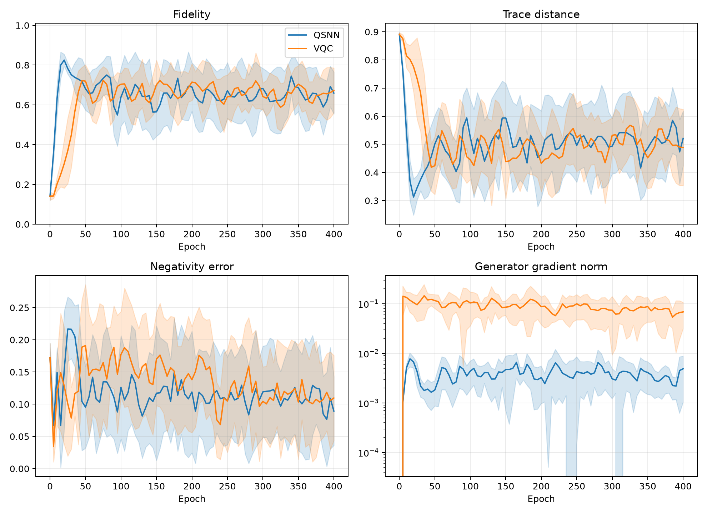

# 固定目标 Werner 混合态 QSNN-GAN 对照实验报告

## 1. 实验目的

本实验不再进行 MNIST 图像生成，而是直接研究量子态生成。核心问题是：在生成器、初始化、训练预算和目标态完全相同时，使用 QSNN 判别器能否比参数量匹配的 VQC 判别器带来更好的固定混合态生成结果。

比较对象为：

- **QSNN-GAN**：纯化 VQC 生成器 + 4-4-2 分层 QSNN 判别器；
- **VQC-GAN**：同一个纯化 VQC 生成器 + 带读出辅助比特的 VQC 判别器。

本报告记录首轮无噪声、精确密度矩阵实验。它属于受控基准，不代表已经完成超参数搜索或硬件噪声实验。

## 2. 固定目标态

目标为两量子比特 Werner 态：

\[
\rho_{\mathrm{target}}
=0.6|\Psi^+\rangle\langle\Psi^+|+0.4\frac{I_4}{4},
\qquad
|\Psi^+\rangle=\frac{|01\rangle+|10\rangle}{\sqrt2}.
\]

其解析性质为：

| 指标 | 理论值 |
|---|---:|
| 特征值 | 0.7, 0.1, 0.1, 0.1 |
| 纯度 | 0.52 |
| Bell 态占据 | 0.70 |
| Negativity | 0.20 |
| \(\langle XX\rangle\) | 0.60 |
| \(\langle YY\rangle\) | 0.60 |
| \(\langle ZZ\rangle\) | -0.60 |

## 3. 模型设计

### 3.1 混合态生成器

生成器从四量子比特纯态开始，其中前两个量子比特为系统 \(S\)，后两个为环境 \(E\)：

\[
|0000\rangle\xrightarrow{U_G(\theta)}|\Phi_G\rangle_{SE},
\qquad
\rho_G=\operatorname{Tr}_E|\Phi_G\rangle\langle\Phi_G|.
\]

电路使用 6 层 RY/RZ 旋转和交替方向的环形 CNOT，共 48 个可训练参数。两个环境量子比特使生成器原则上可以表示任意秩不超过 4 的两量子比特混合态。

### 3.2 QSNN 判别器

QSNN 使用 4-4-2 分层结构：4 个输入节点、4 个隐藏节点、2 个真假输出节点。相干 Hamiltonian 包含全部输入—隐藏边以及输入层内部边，共 22 个参数；定向 Lindblad 传输包含 16 条输入—隐藏边和 8 条隐藏—输出边，共 24 个正速率参数。总计 46 个参数。

输出节点是吸收端，不存在输出到隐藏层的反向传输。初始输入态仅嵌入输入层，输出人口严格为零。未到达输出层的人口按随机猜测处理，因此判别器不能通过降低输出人口获得虚假的条件归一化优势。

### 3.3 VQC 判别器

VQC 判别器使用两个系统量子比特和一个初始化为 \(|0\rangle\) 的读出辅助比特，包含 8 层 RY/RZ 与环形 CNOT，共 48 个可训练参数。最终测量读出量子比特，构成完整的二元 POVM，因此不存在结构性输出泄漏。

判别器参数量为 QSNN 46 对 VQC 48，相差 4.35%。

## 4. 训练设置

| 设置 | 数值 |
|---|---:|
| Werner 参数 | \(p=0.6\) |
| 配对随机种子 | 10 个（0–9） |
| 训练轮数 | 400 |
| 每轮判别器更新 | 1 |
| 每轮生成器更新 | 3 |
| 生成器学习率 | 0.01 |
| 判别器学习率 | 0.01 |
| 优化器 | Adam |
| 梯度裁剪 | 5.0 |
| 数值精度 | float64 / complex128 |
| 模拟方式 | 精确密度矩阵、无 shots、无附加噪声 |

每个种子下两组实验使用完全相同的生成器初始参数。判别器按模型类型独立初始化。

## 5. 生成器容量预检

在对抗训练前，使用相同初始生成器直接最小化生成态与目标态的矩阵误差。10 个种子的平均保真度为 1.000000，最差保真度仍大于 0.999999999999；最大迹距离为 \(4.37\times10^{-7}\)。

因此，后续 GAN 未达到目标态不能归因于生成器无法表示该 Werner 态，而主要来自对抗优化和判别器提供的训练信号。

## 6. 实验结果

下表为 10 个配对种子的均值 ± 样本标准差：

| 指标 | QSNN-GAN | VQC-GAN | 解释 |
|---|---:|---:|---|
| 末轮保真度 ↑ | 0.6593 ± 0.1048 | **0.6729 ± 0.1127** | VQC 略高，差异不显著 |
| 末轮迹距离 ↓ | 0.5212 ± 0.0969 | **0.4888 ± 0.1356** | VQC 略低，差异不显著 |
| 最后 10 个记录点保真度 ↑ | 0.6418 ± 0.0675 | **0.6539 ± 0.0543** | 两者均存在持续振荡 |
| 最后 10 个记录点迹距离 ↓ | 0.5239 ± 0.0604 | **0.5075 ± 0.0531** | 差异较小 |
| 历史最佳保真度 ↑ | **0.8866 ± 0.0333** | 0.8408 ± 0.0155 | QSNN 在 9/10 个配对种子中更高 |
| 历史最小迹距离 ↓ | **0.2442 ± 0.0455** | 0.2604 ± 0.0385 | QSNN 略低，但不显著 |
| 末轮纯度误差 ↓ | **0.2597 ± 0.0973** | 0.2715 ± 0.1322 | QSNN 略好 |
| 末轮 Negativity 误差 ↓ | **0.0894 ± 0.0532** | 0.1097 ± 0.0660 | QSNN 略好 |
| 末轮 Pauli 关联 MAE ↓ | 0.2851 ± 0.2017 | **0.2617 ± 0.1457** | VQC 略好 |
| 单种子平均训练时间 ↓ | **48.0 ± 6.8 秒** | 58.7 ± 6.9 秒 | 本机 CPU 小矩阵模拟 |
| \(F\ge0.99\) 成功率 | 0/10 | 0/10 | 两组均未稳定收敛 |
| \(D_{\mathrm{tr}}\le0.05\) 成功率 | 0/10 | 0/10 | 两组均未稳定收敛 |

配对统计结果：

- 末轮保真度的 QSNN−VQC 平均差为 -0.0136，配对 t 检验 \(p=0.791\)，Wilcoxon 检验 \(p=0.846\)；
- 末轮迹距离的 QSNN−VQC 平均差为 +0.0324，配对 t 检验 \(p=0.564\)，Wilcoxon 检验 \(p=0.695\)；
- 历史最佳保真度的 QSNN−VQC 平均差为 +0.0458，QSNN 在 9/10 个种子中更高，配对 t 检验 \(p=0.00388\)，Wilcoxon 检验 \(p=0.00586\)。

训练曲线如下：



## 7. 结果解释

### 7.1 当前实验没有证明 QSNN-GAN 最终生成质量更优

400 轮末尾，VQC-GAN 的平均保真度和迹距离略优于 QSNN-GAN，但差异远未达到统计显著。配对种子中两者各有 5 个种子的末轮保真度更高。因此不能宣称 QSNN-GAN 在最终固定 Werner 态生成质量上优于 VQC-GAN。

### 7.2 QSNN 表现出更好的早期可达质量

QSNN-GAN 的历史最佳保真度显著更高，并在 9/10 个配对种子中获胜。这说明 QSNN 判别器在训练过程中更容易把生成器推到接近目标态的区域，可能体现了开放系统判别器的归纳偏置或更快的早期学习。

但是，QSNN 的优势没有被稳定保留到训练末期。平均曲线在前 20–30 轮快速上升后长期振荡，历史最佳点随后丢失。因此这更准确地表述为“更高的瞬时最佳性能”，而不是“稳定的最终优势”。

### 7.3 两种 GAN 的主要瓶颈都是对抗优化稳定性

容量预检能达到近乎完美的目标态，但两种 GAN 均未达到 \(F\ge0.99\)。生成器梯度曲线显示 VQC 判别器给出的梯度通常比 QSNN 大约高一个数量级，而 QSNN 梯度较弱但并未完全消失。现有 1:3 更新比例和学习率可能使两种模型都围绕目标区域振荡。

QSNN 最终输出占据率约为 0.823，仍有约 17.7% 人口停留在非输出节点；本实验已把这部分作为随机猜测处理，所以不会产生条件归一化作弊，但它会压缩 QSNN 的有效判别信号。VQC 的完整测量输出质量为 1。

## 8. 物理性与代码验证

全部 1620 条逐轮记录均保持物理性：

- 最大迹漂移：\(6.66\times10^{-16}\)；
- 最大 Hermitian 漂移：\(1.11\times10^{-16}\)；
- 生成态最小特征值的全局最小值：\(1.90\times10^{-7}\)；
- 没有出现负特征值、NaN 或无穷值。

项目完整测试套件共 43 项，全部通过，包括新加入的纯化生成器、Werner 解析性质、分层 QSNN、参数量匹配和梯度传播测试。

## 9. 当前结论

本实验成功完成了固定目标混合态 QSNN-GAN 基准的代码和首轮正式运行，证明：

1. 纯化 VQC 生成器可以精确表示 \(p=0.6\) Werner 态；
2. 4-4-2 QSNN 和参数量匹配的 ancilla-VQC 都可以提供可微判别信号；
3. QSNN-GAN 的历史最佳保真度显著高于 VQC-GAN，表现出更快进入高保真区域的迹象；
4. 该优势没有稳定保持到训练结束；末轮和末段平均指标没有显著差异；
5. 当前结果支持继续研究训练稳定性，但不支持直接声称 QSNN-GAN 已经优于 VQC-GAN。

## 10. 下一步建议

下一轮应优先解决“达到好状态后又离开”的问题，而不是立即扩展到更多目标态：

1. 保存并评估生成器的历史最佳检查点，而不仅是末轮检查点；
2. 分别搜索生成器/判别器学习率以及 1:1、1:3、1:5 更新比例；
3. 使用学习率衰减、TTUR 或指数移动平均稳定生成器；
4. 扫描 QSNN 的目标输出质量和演化时间，增强有效梯度；
5. 调参规则固定后，再扩展到 \(p\in\{0.2,0.4,0.6,0.8\}\)；
6. 最后加入有限 shots、噪声和更多随机种子，避免对单一理想模拟过度解释。

## 11. 复现实验

在项目根目录、`qsnn` Conda 环境中运行：

```powershell
D:\anaconda\envs\qsnn\python.exe scripts\run_fixed_mixed_state_qgan.py `
  --config configs\fixed_werner_p06.yaml `
  --epochs 400 `
  --seeds 0 1 2 3 4 5 6 7 8 9 `
  --device cpu `
  --output-dir outputs\qgan\fixed_werner_p06
```

主要产物：

- `outputs/qgan/fixed_werner_p06/summary.json`：汇总统计；
- `outputs/qgan/fixed_werner_p06/final_metrics.csv`：各种子末轮及历史最佳指标；
- `outputs/qgan/fixed_werner_p06/training_metrics.csv`：逐轮指标；
- `outputs/qgan/fixed_werner_p06/capacity_check.csv`：生成器容量预检；
- `outputs/qgan/fixed_werner_p06/training_curves.png`：均值和标准差曲线；
- `outputs/qgan/fixed_werner_p06/*_seed*.pt`：20 组模型检查点。
