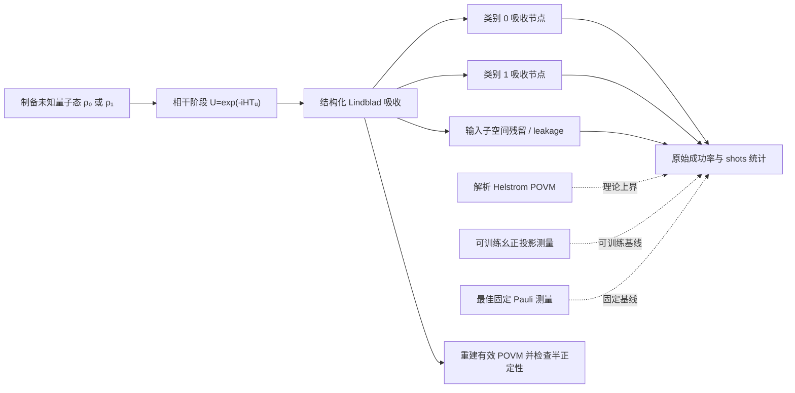

# 单量子比特最小错误态判别中的 QSNN：Helstrom 基准实验报告

> 文档状态：NumPy 参考实验完成，PyTorch/autograd 交叉验证待完成<br>
> 实验规模：5 个态间夹角 × 5 个退极化噪声强度 × 5 个随机种子，共 125 次训练<br>
> 实验完成日期：2026-08-15<br>
> 报告修订日期：2026-08-16<br>
> 硬件状态：未提交云端或量子硬件任务

## 摘要

为使项目从“以量子过程处理经典学习任务”进一步扩展到量子原生任务，本工作构建了单量子比特二元最小错误态判别实验。实验直接接收未知量子态的密度矩阵，不把密度矩阵元素展平为经典特征；QSNN 通过可训练 Hamiltonian 相干演化与结构化 Lindblad 吸收，学习从输入量子态到类别结果的有效 POVM，并以 Holevo–Helstrom 最优成功率作为可解析的理论上界。

完整实验覆盖 5 个 Bloch 球态间夹角、5 个退极化噪声强度与 5 个随机种子，共 125 次训练。NumPy `complex128` 有限差分参考后端的平均 Helstrom gap 为 `0.000505874`，最大 gap 为 `0.000867219`；最大加权输出泄漏为 `0.000257765`；重建的类别效应与泄漏效应均保持半正定，全部运行中的最小本征值为 `0.000190062`。以盲猜成功率 0.5 为基准，QSNN 平均取得了理论最优可判别增益的 `99.6634%`，最差运行仍取得 `99.4476%`。可训练幺正投影测量在约 `10^-13` 的数值误差内达到 Helstrom 上界，说明本任务中最优测量本身不需要耗散过程；因此，本实验支持的结论是“QSNN 能够稳定地学习接近最优、物理可审计的量子测量”，而不是“QSNN 在单量子比特二元判别中优于最优幺正测量”。

当前结果已经通过项目设定的数值筛选门槛，可列为硬件候选，但仍需完成 PyTorch/autograd 复现、重复 shots 统计、消融实验和门级等价性验证。尤其需要在三态或四态单量子比特判别、无歧义判别等真正需要多结果广义 POVM 的任务中，进一步检验 QSNN 耗散读出的独特价值。

**关键词：** 量子随机神经网络；量子态判别；Helstrom 界；开放量子系统；Lindblad 动力学；POVM

## 1. 研究背景与目标

### 1.1 从量子模型处理经典数据到量子原生任务

项目已有工作大多采用“经典样本编码为量子态—量子动力学处理—经典标签读出”的范式。该范式可以研究量子模型的表示能力与训练方法，但任务目标本身通常仍是经典分类、拟合或生成。单量子比特态判别则不同：输入对象本身是量子态，允许的操作是量子信道与量子测量，理论最优值由量子检测理论给出。因此，该任务可以回答 QSNN 是否真正具备“学习量子测量”的能力。

选择 Helstrom 判别作为第一个小型量子任务，主要有三点原因：

1. 理论上界可解析计算，便于判断训练结果是否真正接近最优，而不仅是相对某个经验基线较好；
2. 单量子比特系统可以完整重建有效 POVM，逐项审计概率、完备性和半正定性；
3. 计算量小，适合作为软件实现、优化流程和未来硬件部署链路的单元级验证。

### 1.2 研究问题

本实验围绕以下问题展开：

- **最优性：** QSNN 能否在不同态间夹角和噪声强度下逼近 Helstrom 最优成功率？
- **物理性：** 训练得到的输出是否对应合法的量子测量，是否存在负概率、非半正定效应或隐藏的后选择？
- **稳定性：** 结果是否依赖单个随机初始化或一次有利的有限 shots 抽样？
- **模型作用：** Hamiltonian 与耗散通道分别在判别过程中承担什么功能？
- **优势边界：** 当前实验能支持 QSNN 的哪些优点，又有哪些更强结论尚无证据？
- **部署可行性：** 若数值结果通过门槛，如何把学到的测量转化为模拟器或硬件可执行过程？

## 2. 问题定义与理论基准

### 2.1 输入态族

实验判别等先验概率的两个非正交单量子比特纯态：

$$
|\psi_0\rangle=|0\rangle,
\qquad
|\psi_1\rangle=
\cos\frac{\theta}{2}|0\rangle+
e^{i\phi}\sin\frac{\theta}{2}|1\rangle.
$$

其中，$\theta$ 是两个纯态在 Bloch 球上的夹角，$\phi=37^\circ$。选择非特殊相位 37°，是为了避免最优测量方向与固定 Pauli-X、Y 或 Z 轴偶然重合，从而使固定 Pauli 基线具有实际区分度。纯态密度矩阵为 $\rho_k=|\psi_k\rangle\langle\psi_k|$。

随后对两个状态施加相同强度的退极化信道：

$$
\rho'_k=(1-p)\rho_k+p\frac{I}{2},
$$

其中 $p\in\{0,0.05,0.10,0.20,0.30\}$。需要注意，在等先验且两个状态受到同一退极化信道时，

$$
\rho'_0-\rho'_1=(1-p)(\rho_0-\rho_1),
$$

因此噪声会降低可区分度，但不会改变 Helstrom 测量的本征方向。当前噪声扫描主要检验成功率随可区分度降低时的跟随能力和数值稳定性，并不是最强的“噪声下测量基自适应”测试。

### 2.2 Helstrom 最优成功率

对于先验概率为 $\eta_0,\eta_1$ 的二元量子态，定义判决算符

$$
\Delta=\eta_0\rho_0-\eta_1\rho_1.
$$

将 $\Delta$ 的正、负本征子空间分别判为类别 0 和类别 1，即得到最小错误测量。最优成功率为

$$
P_H=\frac12\left(1+\left\|\Delta\right\|_1\right).
$$

本实验使用等先验 $\eta_0=\eta_1=0.5$。对于无噪声纯态，$|\langle\psi_0|\psi_1\rangle|=\cos(\theta/2)$，因此

$$
P_H=\frac12\left(1+\sin\frac{\theta}{2}\right).
$$

### 2.3 评价指标

主要指标为：

1. **原始判别成功率**

   $$
   P_{\mathrm{QSNN}}=
   \eta_0p(0|\rho_0)+\eta_1p(1|\rho_1).
   $$

2. **Helstrom gap**

   $$
   G_H=P_H-P_{\mathrm{QSNN}}.
   $$

3. **加权泄漏率**

   $$
   P_{\mathrm{leak}}=
   \eta_0p(\mathrm{leak}|\rho_0)+
   \eta_1p(\mathrm{leak}|\rho_1).
   $$

4. **最优可判别增益恢复率**。由于等先验盲猜成功率为 0.5，定义

   $$
   R_{\mathrm{gain}}=
   \frac{P_{\mathrm{QSNN}}-0.5}{P_H-0.5}.
   $$

   该指标衡量 QSNN 取得了多少理论上可获得的、超出盲猜的判别增益。

5. **物理性指标**：重建 $E_0,E_1,E_{\mathrm{leak}}$ 后，检查三个效应的最小本征值。

6. **有限 shots 误差**：比较多项式抽样成功率与精确概率成功率。

## 3. QSNN 判别器

### 3.1 整体流程



模型在四维 Hilbert 空间中工作：前两个基态构成单量子比特输入子空间，另外两个基态作为类别 0 和类别 1 的吸收节点。输入的 $2\times2$ 密度矩阵被直接嵌入四维密度矩阵左上角，没有先转换成供经典网络使用的实数特征向量。

### 3.2 相干阶段：学习测量基

相干阶段使用

$$
H=h_xX+h_yY+h_zZ,
\qquad
U=e^{-iHT_u},
$$

其中 $h_x,h_y,h_z$ 为三个可训练实参数，$T_u=1$。演化后的输入态为

$$
\widetilde\rho=U\rho U^\dagger.
$$

从测量角度看，该阶段的作用是旋转量子态或等价地旋转后续读出基，使“最能区分两个状态的方向”与吸收读出对齐。这是 QSNN 在当前二元任务中最关键的判别自由度。

### 3.3 耗散阶段：学习吸收强度与类别路由

对每个输入基态 $|j\rangle$，模型学习一个正的总跃迁率

$$
\lambda_j=\operatorname{softplus}(a_j)+10^{-9},
$$

以及流向类别 1 的分支概率

$$
q_j=\operatorname{sigmoid}(b_j).
$$

四条 Lindblad 跳跃通道可写为

$$
L_{c,j}=\gamma_{c,j}|c\rangle\langle j|,
$$

并满足

$$
|\gamma_{0,j}|^2=\lambda_j(1-q_j),
\qquad
|\gamma_{1,j}|^2=\lambda_jq_j.
$$

当前配置采用“先完成相干演化，再进行耗散吸收”，即 `coherent_during_dissipation=false`，$T_d=1$。令

$$
d_j=1-e^{-\lambda_jT_d},
\qquad
n_j=\langle j|\widetilde\rho|j\rangle,
$$

则三个原始结果概率为

$$
\begin{aligned}
p(0|\rho)&=\sum_j n_jd_j(1-q_j),\\
p(1|\rho)&=\sum_j n_jd_jq_j,\\
p(\mathrm{leak}|\rho)&=\sum_j n_je^{-\lambda_jT_d}.
\end{aligned}
$$

因此，Hamiltonian 决定“在哪个基上观察”，跃迁率决定“有多少概率被读出”，分支参数决定“每个旋转后基态被路由到哪个类别”。两个阶段共同构成一个可训练量子测量。

### 3.4 有效 POVM

上述概率可以写成标准 POVM 形式：

$$
p(c|\rho)=\operatorname{Tr}(E_c\rho),
$$

其中

$$
\begin{aligned}
E_0&=U^\dagger\operatorname{diag}
\left(d_0(1-q_0),d_1(1-q_1)\right)U,\\
E_1&=U^\dagger\operatorname{diag}
\left(d_0q_0,d_1q_1\right)U,\\
E_{\mathrm{leak}}&=U^\dagger\operatorname{diag}
\left(e^{-\lambda_0T_d},e^{-\lambda_1T_d}\right)U.
\end{aligned}
$$

三者满足

$$
E_0+E_1+E_{\mathrm{leak}}=I.
$$

这一表达式说明，当前结构学习的是三个共享本征基的、可带不确定结果的 POVM。它比固定 Pauli 测量多了可训练基方向和软路由能力；但因为三个效应可同时对角化，其表达能力仍小于一般的非对易多结果 POVM。该边界对解释本实验非常重要。

### 3.5 参数量、初始化与训练目标

QSNN 共 7 个可训练参数：

- 3 个 Hamiltonian 参数 $(h_x,h_y,h_z)$；
- 2 个总跃迁率的无约束参数 $(a_0,a_1)$；
- 2 个类别分支 logit $(b_0,b_1)$。

Hamiltonian 参数按 $0.05\mathcal N(0,1)$ 初始化。初始总跃迁率由目标输出质量 `0.995` 反解得到，初始分支 logit 为 `(-2,2)`，使两个计算基态在训练开始时倾向不同类别，但仍保留可优化空间。

训练目标为

$$
\mathcal L=
-P_{\mathrm{QSNN}}
+0.1P_{\mathrm{leak}}
+10^{-5}\operatorname{mean}(\lambda_j^2)
+10^{-6}\operatorname{mean}(h_j^2).
$$

训练过程使用中心有限差分估计梯度，差分步长为 $10^{-5}$，Adam 学习率为 0.05，$\beta_1=0.9,\beta_2=0.999$，梯度范数裁剪阈值为 10，每次训练 400 轮，并保留训练过程中原始成功率最高的参数。

所有指标均使用两个类别节点的**原始占据概率**。残留输入质量计作失败，不对 $p_0+p_1$ 做事后归一化，也不丢弃 leakage 事件，因此没有通过后选择提高成功率。

## 4. 对照方法与实验设计

### 4.1 对照方法

| 方法 | 可训练参数 | 测量能力 | 在本实验中的作用 |
|---|---:|---|---|
| 解析 Helstrom POVM | 0 | 理论最优二元 POVM | 给出不可超过的成功率上界 |
| 可训练幺正投影测量 | 3 | 任意单量子比特正交投影基 | 检查优化器能否找到最优测量方向 |
| 最佳固定 Pauli 测量 | 0 | 仅 X/Y/Z 三个固定基及标签交换 | 衡量学习测量基相对固定读出的收益 |
| QSNN | 7 | 相干基旋转、吸收强度、软类别路由和 leakage | 被评估模型 |

对于二元单量子比特最小错误判别，Helstrom 测量可以由一个适当的幺正旋转加计算基投影实现。因此，可训练幺正基线不是弱基线，而是本任务中理论上能够达到最优的强基线。

### 4.2 参数扫描

| 项目 | 设置 |
|---|---|
| Bloch 球态间夹角 $\theta$ | 15°、30°、45°、60°、75° |
| 相位 $\phi$ | 37° |
| 噪声模型 | 两个状态受到相同退极化信道 |
| 噪声强度 $p$ | 0、0.05、0.10、0.20、0.30 |
| 先验概率 | $(0.5,0.5)$ |
| 随机种子 | 0、1、2、3、4 |
| 训练轮数 | 400 |
| 相干/耗散时间 | $T_u=T_d=1$ |
| 有限 shots | 128、512、1024，均为每个输入类别的 shots 数 |
| 总运行数 | $5\times5\times5=125$ |

有限 shots 评估对每个输入类别分别进行指定次数的多项式抽样，再按先验概率加权。因此，“1024 shots”对应每个状态 1024 次制备和测量，在包含两个已知标签输入的离线评估中总计 2048 次测量。

### 4.3 数值后端与复现状态

正式实现位于 PyTorch/autograd 后端，参考实现使用 NumPy 闭式前向传播和有限差分 Adam。当前配置不在耗散阶段交错施加 Hamiltonian，因此两个后端描述相同的“先相干、后耗散”数学模型。

完整 125 次结果来自：

- Python 3.12.13；
- NumPy 2.3.5；
- Windows 10；
- `float64/complex128` 精度；
- 总墙钟时间约 49.64 秒。

当前环境没有可用 PyTorch，因此正式后端仅完成语法检查，尚未完成运行级交叉验证。报告中所有训练数值均明确标记为 NumPy 参考结果。

### 4.4 工程筛选门槛

实验预先采用以下硬件候选筛选条件：

- 至少 5 个随机种子；
- 平均 Helstrom gap 不超过 0.01；
- 最大 Helstrom gap 不超过 0.02；
- 最大加权 leakage 不超过 0.005；
- 有效 POVM 最小本征值不低于 $-10^{-7}$；
- 1024-shot 条件平均最大误差不超过 0.02。

这些条件是项目内部工程门槛，不等同于统计显著性检验，也不能替代硬件前验证。

## 5. 实验结果

### 5.1 总体结果与门槛检查

| 指标 | 实测值 | 门槛 | 结果 |
|---|---:|---:|:---:|
| 运行数 | 125 | 125 | 通过 |
| 独立随机种子数 | 5 | ≥ 5 | 通过 |
| 平均 Helstrom gap | 0.000505874 | ≤ 0.01 | 通过 |
| 最大 Helstrom gap | 0.000867219 | ≤ 0.02 | 通过 |
| 平均加权 leakage | 0.000224246 | — | 记录 |
| 最大加权 leakage | 0.000257765 | ≤ 0.005 | 通过 |
| 有效 POVM 最小本征值 | 0.000190062 | ≥ -1e-7 | 通过 |
| 1024-shot 逐次运行平均绝对误差 | 0.00790244 | — | 记录 |
| 1024-shot 最大条件平均误差 | 0.00594992 | ≤ 0.02 | 通过 |

平均 Helstrom 成功率为 `0.663628739`，平均 QSNN 成功率为 `0.663122865`。全部数值筛选门槛均通过。

### 5.2 随态间夹角变化

下表对全部噪声强度和随机种子取平均：

| 夹角 | Helstrom | QSNN | Helstrom gap | 最佳固定 Pauli | leakage |
|---:|---:|---:|---:|---:|---:|
| 15° | 0.556779 | 0.556519 | 0.000260 | 0.544958 | 0.000254 |
| 30° | 0.612586 | 0.612205 | 0.000382 | 0.586852 | 0.000236 |
| 45° | 0.666467 | 0.665966 | 0.000501 | 0.622827 | 0.000222 |
| 60° | 0.717500 | 0.716870 | 0.000630 | 0.650431 | 0.000209 |
| 75° | 0.764811 | 0.764055 | 0.000756 | 0.667784 | 0.000199 |

随着态间夹角增大，两个状态的重叠降低，Helstrom 与 QSNN 成功率同步上升。绝对 gap 也随夹角略有增大，但在所有角度均低于 0.001。leakage 随夹角增大而略微下降，说明优化器在较易区分的任务中倾向于学习稍强的有效吸收。

### 5.3 随退极化噪声变化

下表对全部夹角和随机种子取平均：

| 噪声强度 | Helstrom | QSNN | Helstrom gap | 最佳固定 Pauli | leakage |
|---:|---:|---:|---:|---:|---:|
| 0.00 | 0.688079 | 0.687518 | 0.000561 | 0.631690 | 0.000219 |
| 0.05 | 0.678675 | 0.678135 | 0.000540 | 0.625106 | 0.000221 |
| 0.10 | 0.669271 | 0.668753 | 0.000519 | 0.618521 | 0.000223 |
| 0.20 | 0.650463 | 0.649987 | 0.000476 | 0.605352 | 0.000227 |
| 0.30 | 0.631655 | 0.631221 | 0.000434 | 0.592183 | 0.000232 |

退极化噪声使状态向最大混合态收缩，理论最优成功率与所有模型的成功率均下降。QSNN 在整个噪声区间内保持接近 Helstrom 上界。噪声增大时绝对 gap 变小，不能解释为模型在强噪声下变得更强；主要原因是 $P_H-0.5$ 本身也随可区分度一起收缩。

### 5.4 与基线的比较

- 可训练幺正投影测量的平均 Helstrom gap 为 `1.54e-14`，最大 gap 为 `1.08e-13`，在数值精度内达到解析上界。
- 最佳固定 Pauli 测量的平均成功率约为 `0.614570375`。
- QSNN 相比最佳固定 Pauli 测量平均提高 `0.0485525`，即约 **4.86 个百分点**。
- 以超出盲猜的理论增益为分母，QSNN 的平均 $R_{\mathrm{gain}}$ 为 `99.6634%`，最差为 `99.4476%`；最佳固定 Pauli 测量平均只取得 `72.5262%`。

上述结果表明，QSNN 确实学到了与输入态族相匹配的测量方向，而不是停留在固定计算基或固定 Pauli 读出。但幺正基线已经精确达到 Helstrom 上界，因此当前任务没有显示 QSNN 相对最优幺正测量的成功率优势。

### 5.5 随机初始化稳定性

| seed | 平均 QSNN 成功率 | 平均 Helstrom gap | 平均 leakage |
|---:|---:|---:|---:|
| 0 | 0.663121090 | 0.000507649 | 0.000224202 |
| 1 | 0.663115708 | 0.000513031 | 0.000224143 |
| 2 | 0.663124269 | 0.000504470 | 0.000224236 |
| 3 | 0.663136967 | 0.000491771 | 0.000224502 |
| 4 | 0.663116289 | 0.000512449 | 0.000224149 |

在每个“夹角—噪声”条件内，对 5 个种子计算描述性总体标准差：成功率标准差的条件平均值为 `1.39e-5`，最大值为 `2.48e-5`。这说明在当前低维、平滑的优化问题上，训练对初始化不敏感。不过，5 个种子仍不足以刻画大型 QSNN 的复杂优化景观，不能把这一稳定性直接外推到高维任务。

### 5.6 有限 shots 稳定性

| 每个输入态的 shots | 逐次运行平均绝对误差 | 逐次运行最大误差 | 5 种子条件平均最大误差 |
|---:|---:|---:|---:|
| 128 | 0.018549 | 0.043084 | 0.017833 |
| 512 | 0.010828 | 0.022173 | 0.005977 |
| 1024 | 0.007902 | 0.026994 | 0.005950 |

单次有限 shots 结果仍可能偏离精确概率 2%–4%，但对同一物理条件的多次运行取平均后误差明显下降。512 与 1024 shots 的“最大条件平均误差”接近，是因为每个运行和 shots 数目前只抽取一次，并未对同一模型进行大量 Monte Carlo 重复；这张表不能替代置信区间分析。

### 5.7 代表性案例：$\theta=60^\circ,p=0,\mathrm{seed}=0$

该条件下：

- Helstrom 成功率：`0.750000000`；
- QSNN 成功率：`0.749289504`；
- Helstrom gap：`0.000710496`；
- 加权 leakage：`0.000202435`；
- 可训练幺正基线成功率：`0.750000000`；
- 最佳固定 Pauli 成功率：`0.672909660`。

训练后两个物理总跃迁率约为 `8.4975` 和 `8.5127`，对应吸收比例 `99.9796%` 和 `99.9799%`；两个旋转后基态流向类别 1 的分支概率约为 `0.001118` 和 `0.998882`。这表明模型首先通过 Hamiltonian 找到接近 Helstrom 的判别基，再通过耗散通道把两个基态近乎确定性地送往相反类别。

重建的有效效应近似为

$$
E_0\approx
\begin{pmatrix}
0.749287 & -0.344976+0.259959i\\
-0.344976-0.259959i & 0.250509
\end{pmatrix},
$$

$$
E_1\approx
\begin{pmatrix}
0.250509 & 0.344977-0.259959i\\
0.344977+0.259959i & 0.749290
\end{pmatrix}.
$$

两个类别效应的最小本征值分别为 `0.00111738` 和 `0.00111730`，泄漏效应的最小本征值为 `0.000200898`。它们接近一对略有收缩的互补秩一投影，收缩部分对应有限吸收和 leakage。

### 5.8 最差情况与物理性

- 最大 gap 出现在 `θ=75°、p=0、seed=1`：Helstrom 为 `0.804380715`，QSNN 为 `0.803513496`，gap 为 `0.000867219`。
- 最大 leakage 出现在 `θ=15°、p=0.3、seed=3`：`0.000257765`。
- 125 次运行中最小的 POVM 效应本征值为正值 `0.000190062`，未发现负概率或非物理效应。
- 平均 gap 约为平均 leakage 的 2.26 倍；逐次运行的 gap/leakage 比值平均约为 2.35。这说明有限吸收只解释了部分最优性差距，其余差距来自效应方向或软路由尚未完全达到理想投影，以及正则化与有限训练造成的偏差。

## 6. QSNN 在判别中的作用

### 6.1 它不是经典分类器，而是可训练测量

本实验中，QSNN 不读取某个预先计算的经典 Bloch 向量，也不把四个复密度矩阵元素作为普通网络输入。模型直接对 $\rho$ 施加量子信道，并从输出吸收节点读取 Born 概率。因此它承担的是“设计并执行测量”的角色，而不仅是“对测量后的经典数据分类”。

从操作角度看，QSNN 完成三件事：

1. **测量基对齐：** Hamiltonian 把最有判别力的 Bloch 方向旋转到读出基；
2. **不可逆读出：** Lindblad 跳跃把输入子空间的信息转移到类别吸收节点，形成稳定的经典结果；
3. **不确定性显式化：** 未被吸收的概率保留为 leakage，而不是在归一化时被隐藏。

### 6.2 当前实验中得到数据支持的优点

| QSNN 优点 | 机制 | 当前实验中的证据 | 结论边界 |
|---|---|---|---|
| 量子原生输入 | 直接演化密度矩阵 | 输入始终为合法 $2\times2$ 密度矩阵 | 数值模拟仍由经典计算机执行，不等于计算加速 |
| 可学习测量方向 | 三参数 Hamiltonian 旋转读出基 | 比最佳固定 Pauli 平均高 4.86 个百分点 | 没有高于最优可训练幺正测量 |
| 接近理论最优 | 相干基对齐与近确定性耗散路由 | 平均恢复 99.6634% 的最优判别增益 | 只覆盖二元、等先验、单量子比特态族 |
| 物理约束明确 | 正跃迁率、CPTP Lindblad 演化、Born 读出 | 三个有效效应最小本征值均非负 | 正式 PyTorch 后端尚未运行验证 |
| 可解释与可审计 | 参数对应 Hamiltonian、速率和类别分支 | 可重建 $E_0,E_1,E_{\mathrm{leak}}$ 并复现正向概率 | 高维系统的完整 POVM 层析成本会快速增长 |
| 失败事件不被隐藏 | leakage 作为第三结果 | 最大 leakage 仅 0.0258%，且始终计作失败 | leakage 很低部分来自较大的可训练吸收率 |
| 当前优化稳定 | 低维参数化和解析结构 | 条件内最大种子标准差约 $2.48\times10^{-5}$ | 不能外推到大型、多层或强噪声 QSNN |
| 参数量小 | 当前模型仅 7 个实参数 | 125 次训练约 50 秒完成 | 经典密度矩阵模拟随比特数指数增长 |

### 6.3 尚未体现的潜在优势

当前 Helstrom 任务的最优测量是一组二结果正交投影，可训练幺正基线已经达到理论极限。因而，QSNN 的耗散部分在成功率上没有表现出相对最优幺正测量的必要性。在适当扩展模型结构后，QSNN 更有可能在以下任务中体现独特价值：

- 三个或更多非正交状态的最小错误判别，其中最优 POVM 具有三个或更多结果；
- 无歧义态判别，其中需要显式的“无法判定”结果；
- 非对易噪声、状态相关噪声或开放系统输入下的联合测量设计；
- 多类别吸收网络和带有层级、时序结构的量子决策过程；
- 硬件天然支持耗散、复位或 reservoir engineering 时的原生实现。

这些目前都属于合理的研究方向，而不是已经由本实验验证的优势。

## 7. 结果解释中的限制

### 7.1 不能宣称单比特二元任务中的量子优势

本实验的输入和测量问题是量子原生的，但求解训练参数的 NumPy 有限差分过程仍是经典优化，且完整密度矩阵模拟没有可扩展性优势。更重要的是，可训练幺正基线已达到 Helstrom 上界。因此当前结果不能被表述为 QSNN 超越标准量子测量，也不能被表述为相对经典计算的量子加速。

### 7.2 当前噪声模型较容易

相同的退极化信道只缩小两个状态之差，不旋转最优测量基。它适合检查可区分度下降和数值稳定性，但不足以说明模型能适应会改变最优测量方向的噪声。振幅阻尼、相位阻尼、状态相关噪声和制备偏差应作为后续重点。

### 7.3 没有训练—测试分离

当前每个状态对都单独训练并在同一状态对上评估，测试的是“能否优化出该实例的测量”，而不是“能否从若干训练态泛化到未见状态”。如果目标是学习一个可迁移的量子判别器，需要在角度、相位、噪声和先验分布上设置训练集与留出测试集。

### 7.4 统计证据仍有限

每个条件使用 5 个优化种子，足以作为初步稳定性筛查，但尚不足以建立严格的置信区间。每个 shots 数也只进行了一次随机抽样，不能据此估计尾部风险或硬件所需样本量。

### 7.5 后端交叉验证缺失

NumPy 参考后端使用闭式前向传播和有限差分梯度；正式实现使用 PyTorch 复数自动微分和四维密度矩阵演化。虽然两者描述当前配置下相同的数学模型，但尚需逐条件验证成功率、概率、梯度趋势和有效 POVM 的一致性。

## 8. 待补充实验

### 8.1 硬件前必须完成的 P0 实验

| 实验 | 具体设计 | 主要指标 | 目的 |
|---|---|---|---|
| PyTorch/autograd 交叉验证 | 复跑完整 125 条件，保留相同配置和种子 | 成功率、gap、leakage、POVM 元素差异 | 排除参考后端特有结论 |
| 局部梯度核对 | 随机选取参数点，对比 autograd 与中心有限差分 | 相对梯度误差 | 验证复数自动微分和参数化 |
| 重复 shots Monte Carlo | 每个条件、每个 shots 数重复 100–1000 次 | 均值、标准差、95% 区间、最差分位数 | 给出可靠样本量与误差条 |
| 编译前后等价性 | 将学到的 POVM 转换为门模型过程 | 输出总变差距离、成功率差、资源量 | 确保硬件电路实现同一测量 |
| 结果越界审计 | 记录有符号 $P_H-P_{\mathrm{model}}$，不只截断为非负 gap | 超界次数和最大超界量 | 防止数值问题被 `max(·,0)` 隐藏 |

建议将 NumPy 与 PyTorch 的聚合成功率差控制在 `1e-3` 以内，并对代表性参数点直接比较正向概率和有效 POVM，而不是要求两个优化器最终得到完全相同的参数。

### 8.2 机制消融实验

| 消融 | 修改方式 | 要回答的问题 |
|---|---|---|
| H-only | 关闭耗散软路由，保留幺正旋转与投影测量 | 当前性能有多少来自测量基学习？ |
| L-only | 固定 $H=0$，只训练速率与分支 | 没有相干基旋转时耗散层能做到什么？ |
| 固定吸收率 | 固定 $\lambda_j$，只训练 $H,q_j$ | 可训练速率是否只是减少 leakage？ |
| 固定分支 | 固定近确定性类别路由，只训练 $H,\lambda_j$ | 软路由是否对二元任务必要？ |
| leakage penalty 扫描 | 系数取 0、0.01、0.1、1.0 | 成功率、吸收率和正则化之间如何权衡？ |
| 时间扫描 | 扫描 $T_u,T_d$ | 结果是否依赖当前时间尺度与速率的等价重参数化？ |

当前可训练幺正基线已经相当于一种 H-only 强基线，但仍应在统一初始化、损失、训练预算和报告格式下完成正式消融表。

### 8.3 泛化与鲁棒性实验

建议补充：

1. 夹角从 0° 到 180° 的致密扫描，特别加入接近相同态和接近正交态的边界区域；
2. 相位 $\phi\in[0,360^\circ)$ 扫描，避免只在一个测量平面上评估；
3. 不等先验，例如 $(0.1,0.9)$、$(0.3,0.7)$、$(0.5,0.5)$；
4. 振幅阻尼、相位阻尼、状态相关噪声与制备旋转误差；
5. 在部分角度、相位和噪声条件上训练，在留出条件上测试；
6. 在训练态附近加入小扰动，测量有效 POVM 对制备误差的敏感度；
7. 报告有效 POVM 与解析 Helstrom POVM 的矩阵距离或测量通道操作距离。

### 8.4 更能体现 QSNN 特点的量子任务

| 任务 | 推荐规模 | 为什么重要 |
|---|---:|---|
| Trine 三态最小错误判别 | 1 qubit，3 个输出 | 最优测量是非对易三结果 POVM，可直接检验扩展 QSNN 的表达能力 |
| 四面体/SIC 四态判别 | 1 qubit，4 个输出 | 检验多吸收节点和对称广义测量学习能力 |
| 两个纯态无歧义判别 | 1 qubit，成功/失败/不确定 | leakage 或独立吸收节点可自然表示 inconclusive 结果 |
| 混合态判别 | 1–2 qubits | 检验开放系统输入与非纯态测量 |
| 量子信道判别 | 1–2 qubits + 辅助比特 | 输入对象升级为量子过程，可研究辅助纠缠策略 |
| 多拷贝集体测量 | 2–4 qubits | 检验 QSNN 是否能学习超过逐比特局域测量的集体策略 |

其中，Trine 三态判别最适合作为下一项小型实验：仍可在单量子比特上精确模拟和解析比较，但能够真正测试多输出 POVM，而不只是重现一个旋转后的投影测量。当前“单次统一旋转 + 同一基上的耗散分支”产生的效应可同时对角化，不能表示理想 Trine POVM；因此该实验需要引入相干—耗散交错、多阶段结构或辅助空间，并把“是否达到 Trine 最优界”作为模型表达能力测试，而不是简单增加第三个吸收节点。

### 8.5 硬件实验设计

当前有效效应 $E_0,E_1,E_{\mathrm{leak}}$ 共享同一测量本征基，因此最简功能等价实现是：

1. 执行训练得到的单量子比特基旋转；
2. 在计算基测量；
3. 根据对应的吸收比例和分支概率进行经典随机后处理，产生类别 0、类别 1 或 leakage。

如果要求全量子、无经典随机后处理的实现，可以使用辅助空间构造 Naimark dilation；如果要求复现原始耗散动力学，则需要辅助能级、复位、动态电路或开放系统数字模拟。三种部署路径必须在报告中区分，不能把“功能等价 POVM”与“原始 Lindblad 过程复现”混为一谈。

真机比较至少应包含：

- 编译后的 QSNN 等效测量；
- 直接编译的 Helstrom/幺正投影测量；
- 固定 Pauli 测量；
- 相同 shots、编译等级与误差缓解预算；
- 多个独立批次及置信区间；
- 成功率、leakage、总变差距离、单/双比特门数和电路深度。

在用户明确指定硬件后端并授权前，不应提交真实硬件任务。

## 9. 结论

本实验完成了项目中的第一个小型量子原生 QSNN 任务。结果表明，7 参数 QSNN 可以直接对单量子比特密度矩阵实施可训练量子过程，学习到接近 Helstrom 最优测量的有效 POVM；其平均 Helstrom gap 约为 `5.06e-4`，平均恢复 `99.6634%` 的最优可判别增益，并在 125 次运行中保持低 leakage、合法 POVM 和很小的随机种子波动。

QSNN 在本任务中的核心作用可以概括为：Hamiltonian 学习判别基，Lindblad 吸收把量子态信息不可逆地路由到类别节点，leakage 则把未完成读出显式保留。其优点主要体现在量子原生输入、物理可解释、可审计和接近最优，而不是相对幺正投影测量的成功率提升。由于二元单量子比特 Helstrom 测量本身就是投影测量，当前实验更适合作为 QSNN 量子测量能力与软件正确性的基准，而不是架构优势的最终证明。

因此，建议按以下顺序推进：先完成 PyTorch/autograd 与重复 shots 交叉验证；随后进行 H/L 消融、非对易噪声和留出态泛化；再开展 Trine 三态等广义 POVM 任务。只有这些验证通过后，才进入编译和量子硬件测试阶段。

## 附录 A：复现命令

NumPy 完整参考实验：

```powershell
python scripts/run_qubit_helstrom_numpy.py `
  --config configs/qubit_helstrom_full.json
```

具备 PyTorch 后运行正式实现：

```powershell
python scripts/run_qubit_helstrom.py `
  --config configs/qubit_helstrom_full.json
```

NumPy 单元测试：

```powershell
python -m unittest tests.test_qubit_helstrom_numpy -v
```

## 附录 B：产物索引

- 配置：`configs/qubit_helstrom_full.json`
- 任务实现：`tasks/quantum_state_discrimination/`
- NumPy 运行入口：`scripts/run_qubit_helstrom_numpy.py`
- PyTorch 运行入口：`scripts/run_qubit_helstrom.py`
- 逐次结果：`outputs/quantum_tasks/qubit_helstrom/full/numpy_reference/results.csv`
- 完整参数与 POVM：`outputs/quantum_tasks/qubit_helstrom/full/numpy_reference/results.json`
- 汇总指标：`outputs/quantum_tasks/qubit_helstrom/full/numpy_reference/summary.json`
