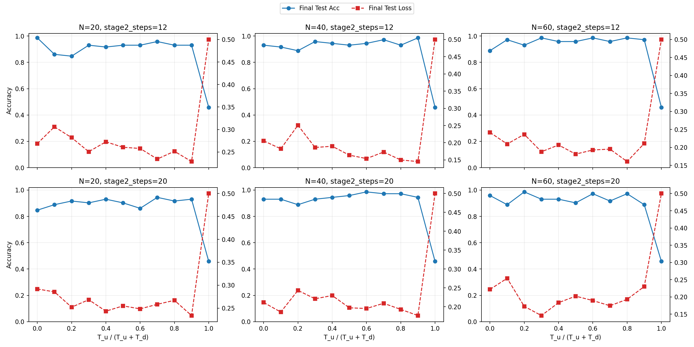

# QSNN2D 时间占比综合对比报告

### 实验设置

- 模型：`QSNN2D`
- 比例：$r=T_u/(T_u+T_d) \in \{0.0,0.1,\dots,1.0\}$（**含端点**）
- 总时间：$T_u+T_d=2.0$
- 组合：
  - $N \in \{20,40,60\}$（对应 $N_{in}=N-2$）
  - `stage2_steps` ∈ {12, 20}
  - 共 6 组配置
- 数据：`make_circles(n=240, noise=0.05, factor=0.5, seed=0)`，70/30 划分
- 训练：20 epochs，Adam，lr=3e-2
- 设备：CUDA

脚本与结果：
- 脚本：[sweep_tu_td_grid.py](sweep_tu_td_grid.py)
- 数据：[tu_td_grid_N20_40_60_s2_12_20.csv](tu_td_grid_N20_40_60_s2_12_20.csv)
- 图像：[tu_td_grid_N20_40_60_s2_12_20.png](tu_td_grid_N20_40_60_s2_12_20.png)

---

## 3) 综合图

---

## 4) 关键观察

1. **端点验证通过**
- $r=1.0$（仅 stage-1，$T_d=0$）在六组中均退化到：
  - `final_test_acc ≈ 0.4583`
  - `final_test_loss ≈ 0.5000`
- 说明“只有相干过程、无耗散读出”时分类能力明显不足。

2. $r=0.0$（仅 stage-2）可运行且有一定分类能力
- 但整体不稳定，且通常不如中间配比或偏单侧最优点。

3. 最优配比**依赖 N 与 stage2_steps**
- 不存在全局唯一最优比例。
- 六组“按 final_test_acc 最优”如下：
  - N=20, s2=12: r=0.0（acc=0.9861）
  - N=40, s2=12: r=0.9（acc=0.9861）
  - N=60, s2=12: r=0.3（acc=0.9861）
  - N=20, s2=20: r=0.7（acc=0.9444）
  - N=40, s2=20: r=0.6（acc=0.9861）
  - N=60, s2=20: r=0.2（acc=0.9861）

4. `stage2_steps` 增大并不保证更好
- 从 12 增至 20 后，部分配置精度提升，部分下降；
- 说明这里存在“数值精度-优化动力学”耦合，不是单向收益。

---

## 5) 实践建议

1. 在目标平台上，不要固定某个经验占比，建议对每个 N 做小网格搜索（含端点）。
2. 端点结果应保留在报告中：
- 能清晰证明两阶段各自必要性和边界行为。
3. 若做正式结论，建议每个点至少 3~5 个随机种子，报告均值±方差。
